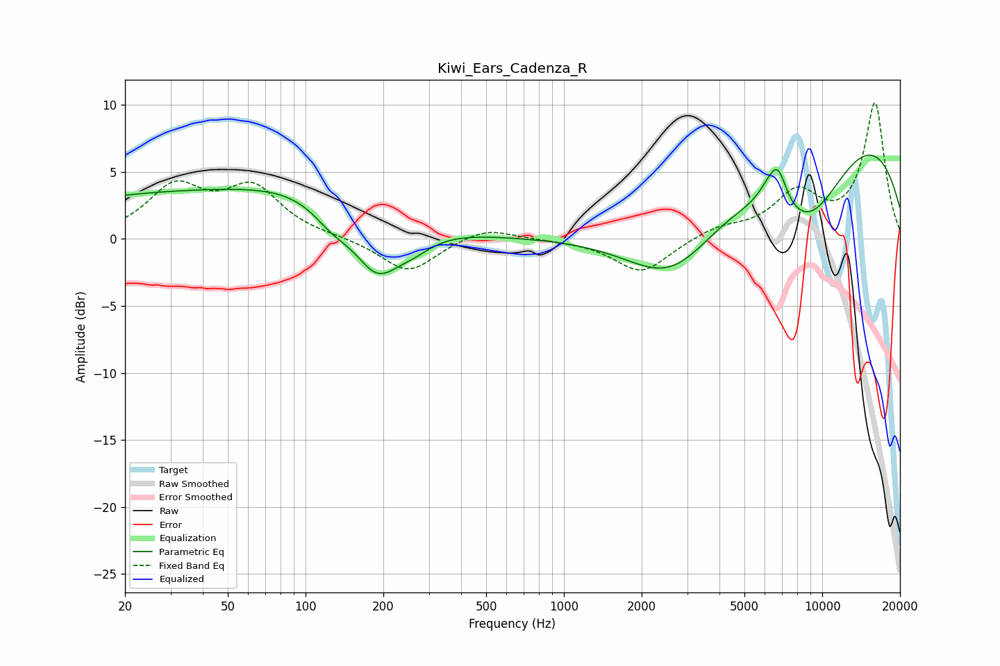

# Kiwi_Ears_Cadenza_R
See [usage instructions](https://github.com/jaakkopasanen/AutoEq#usage) for more options and info.

### Parametric EQs
Apply preamp of -6.3 dB when using parametric equalizer.

|   # | Type    |   Fc (Hz) |    Q |   Gain (dB) |
|-----|---------|-----------|------|-------------|
|   1 | Peaking |        42 | 0.18 |         3.5 |
|   2 | Peaking |       100 | 0.65 |         0.9 |
|   3 | Peaking |       127 | 1.78 |        -1.5 |
|   4 | Peaking |       189 | 1.56 |        -4.3 |
|   5 | Peaking |       263 | 1.83 |        -1.1 |
|   6 | Peaking |      2638 | 0.74 |        -5.8 |
|   7 | Peaking |      6238 | 3.15 |         1.3 |
|   8 | Peaking |      6765 | 4.07 |         2.4 |
|   9 | Peaking |      8794 | 0.7  |        -8.5 |
|  10 | Peaking |     10000 | 0.25 |        11   |

### Fixed Band EQs
When using fixed band (also called graphic) equalizer, apply preamp of **-10.2 dB** (if available) and set gains manually with these parameters.

|   # | Type    |   Fc (Hz) |    Q |   Gain (dB) |
|-----|---------|-----------|------|-------------|
|   1 | Peaking |        31 | 1.41 |         3.7 |
|   2 | Peaking |        62 | 1.41 |         3.6 |
|   3 | Peaking |       125 | 1.41 |         0.1 |
|   4 | Peaking |       250 | 1.41 |        -2.6 |
|   5 | Peaking |       500 | 1.41 |         1   |
|   6 | Peaking |      1000 | 1.41 |        -0   |
|   7 | Peaking |      2000 | 1.41 |        -2.6 |
|   8 | Peaking |      4000 | 1.41 |         0.8 |
|   9 | Peaking |      8000 | 1.41 |         3.2 |
|  10 | Peaking |     16000 | 1.41 |        10   |

### Graphs

