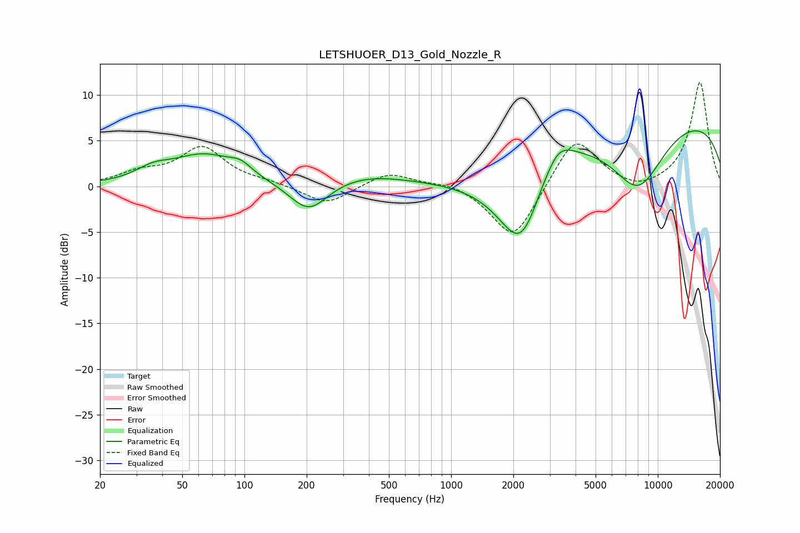

# LETSHUOER_D13_Gold_Nozzle_R
See [usage instructions](https://github.com/jaakkopasanen/AutoEq#usage) for more options and info.

### Parametric EQs
Apply preamp of -6.2 dB when using parametric equalizer.

|   # | Type    |   Fc (Hz) |    Q |   Gain (dB) |
|-----|---------|-----------|------|-------------|
|   1 | Peaking |        36 | 1.78 |         1.1 |
|   2 | Peaking |        64 | 0.89 |         3.3 |
|   3 | Peaking |        96 | 2.63 |         1   |
|   4 | Peaking |       205 | 1.5  |        -3.5 |
|   5 | Peaking |       368 | 0.64 |         1.3 |
|   6 | Peaking |      2192 | 1.19 |       -10.1 |
|   7 | Peaking |      3074 | 2.57 |        -3.2 |
|   8 | Peaking |      3128 | 1.92 |         7.2 |
|   9 | Peaking |      8036 | 0.98 |        -7.6 |
|  10 | Peaking |     10000 | 0.19 |         8.1 |

### Fixed Band EQs
When using fixed band (also called graphic) equalizer, apply preamp of **-11.5 dB** (if available) and set gains manually with these parameters.

|   # | Type    |   Fc (Hz) |    Q |   Gain (dB) |
|-----|---------|-----------|------|-------------|
|   1 | Peaking |        31 | 1.41 |         1.3 |
|   2 | Peaking |        62 | 1.41 |         4.1 |
|   3 | Peaking |       125 | 1.41 |         0.4 |
|   4 | Peaking |       250 | 1.41 |        -2.1 |
|   5 | Peaking |       500 | 1.41 |         1.6 |
|   6 | Peaking |      1000 | 1.41 |         0.6 |
|   7 | Peaking |      2000 | 1.41 |        -6.1 |
|   8 | Peaking |      4000 | 1.41 |         5.6 |
|   9 | Peaking |      8000 | 1.41 |        -0.8 |
|  10 | Peaking |     16000 | 1.41 |        11.5 |

### Graphs

