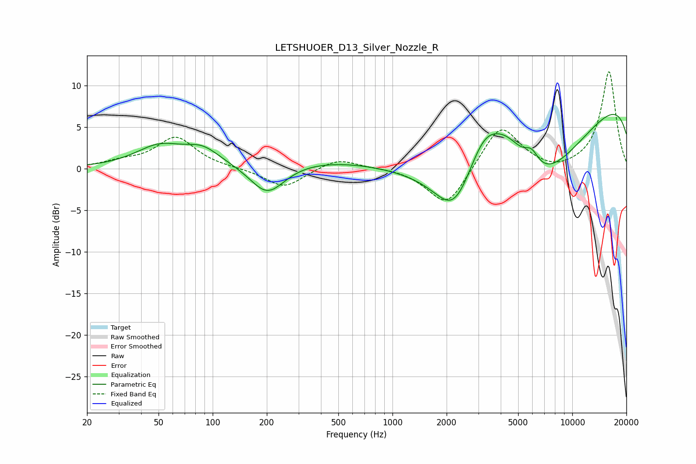

# LETSHUOER_D13_Silver_Nozzle_R
See [usage instructions](https://github.com/jaakkopasanen/AutoEq#usage) for more options and info.

### Parametric EQs
Apply preamp of -6.6 dB when using parametric equalizer.

|   # | Type    |   Fc (Hz) |    Q |   Gain (dB) |
|-----|---------|-----------|------|-------------|
|   1 | Peaking |        50 | 1.06 |         2.5 |
|   2 | Peaking |        88 | 1.46 |         1.8 |
|   3 | Peaking |       201 | 1.44 |        -3.9 |
|   4 | Peaking |       431 | 0.3  |         1.3 |
|   5 | Peaking |      2210 | 1.34 |        -5.5 |
|   6 | Peaking |      3234 | 1.36 |         5.6 |
|   7 | Peaking |      4415 | 1.21 |         5.1 |
|   8 | Peaking |      5855 | 0.34 |       -16   |
|   9 | Peaking |      5930 | 3.35 |         2   |
|  10 | Peaking |     10000 | 0.18 |        13.7 |

### Fixed Band EQs
When using fixed band (also called graphic) equalizer, apply preamp of **-11.8 dB** (if available) and set gains manually with these parameters.

|   # | Type    |   Fc (Hz) |    Q |   Gain (dB) |
|-----|---------|-----------|------|-------------|
|   1 | Peaking |        31 | 1.41 |         0.7 |
|   2 | Peaking |        62 | 1.41 |         3.7 |
|   3 | Peaking |       125 | 1.41 |         0   |
|   4 | Peaking |       250 | 1.41 |        -2.3 |
|   5 | Peaking |       500 | 1.41 |         1.3 |
|   6 | Peaking |      1000 | 1.41 |         0.1 |
|   7 | Peaking |      2000 | 1.41 |        -4.7 |
|   8 | Peaking |      4000 | 1.41 |         5.4 |
|   9 | Peaking |      8000 | 1.41 |        -0.6 |
|  10 | Peaking |     16000 | 1.41 |        11.7 |

### Graphs

