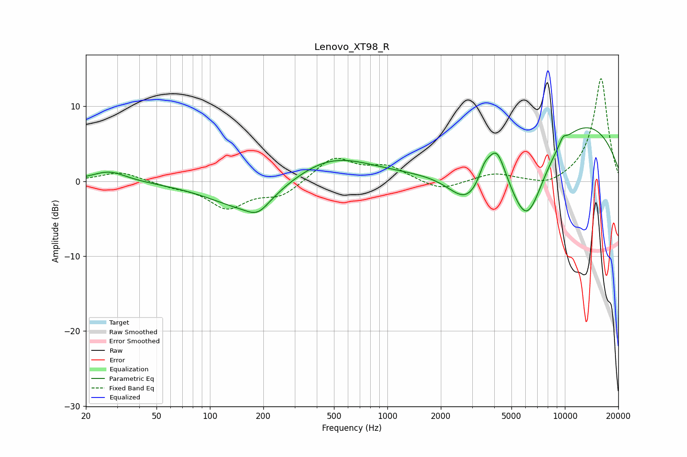

# Lenovo_XT98_R
See [usage instructions](https://github.com/jaakkopasanen/AutoEq#usage) for more options and info.

### Parametric EQs
Apply preamp of -7.2 dB when using parametric equalizer.

|   # | Type    |   Fc (Hz) |    Q |   Gain (dB) |
|-----|---------|-----------|------|-------------|
|   1 | Peaking |        27 | 1.5  |         1.4 |
|   2 | Peaking |       162 | 0.68 |        -3.9 |
|   3 | Peaking |       187 | 2.23 |        -1.7 |
|   4 | Peaking |       476 | 0.61 |         3.6 |
|   5 | Peaking |      2820 | 1.28 |        -4.8 |
|   6 | Peaking |      3513 | 4.52 |         1.7 |
|   7 | Peaking |      4113 | 2.61 |         5.2 |
|   8 | Peaking |      6105 | 1.15 |       -12.3 |
|   9 | Peaking |      9736 | 5.94 |         0.9 |
|  10 | Peaking |     10000 | 0.28 |         9.4 |

### Fixed Band EQs
When using fixed band (also called graphic) equalizer, apply preamp of **-13.8 dB** (if available) and set gains manually with these parameters.

|   # | Type    |   Fc (Hz) |    Q |   Gain (dB) |
|-----|---------|-----------|------|-------------|
|   1 | Peaking |        31 | 1.41 |         1.3 |
|   2 | Peaking |        62 | 1.41 |        -0.6 |
|   3 | Peaking |       125 | 1.41 |        -3.4 |
|   4 | Peaking |       250 | 1.41 |        -1.9 |
|   5 | Peaking |       500 | 1.41 |         3.2 |
|   6 | Peaking |      1000 | 1.41 |         1.8 |
|   7 | Peaking |      2000 | 1.41 |        -1.4 |
|   8 | Peaking |      4000 | 1.41 |         1   |
|   9 | Peaking |      8000 | 1.41 |        -0.9 |
|  10 | Peaking |     16000 | 1.41 |        13.8 |

### Graphs

