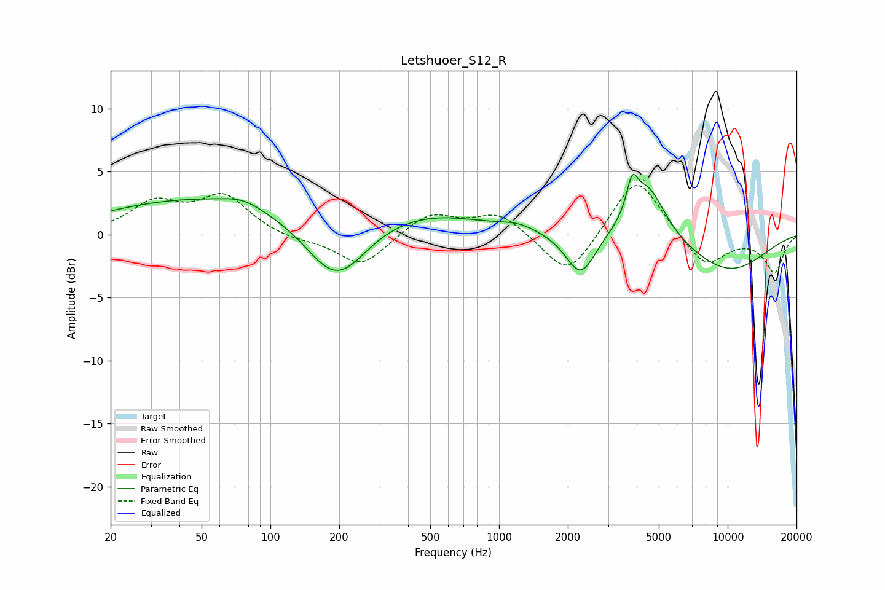

# Letshuoer_S12_R
See [usage instructions](https://github.com/jaakkopasanen/AutoEq#usage) for more options and info.

### Parametric EQs
Apply preamp of -4.9 dB when using parametric equalizer.

|   # | Type    |   Fc (Hz) |    Q |   Gain (dB) |
|-----|---------|-----------|------|-------------|
|   1 | Peaking |        49 | 0.34 |         2.8 |
|   2 | Peaking |        76 | 1.67 |         0.6 |
|   3 | Peaking |       185 | 1.16 |        -3.6 |
|   4 | Peaking |       218 | 1.34 |        -1.2 |
|   5 | Peaking |       486 | 0.58 |         1.6 |
|   6 | Peaking |      1215 | 1.7  |         0.5 |
|   7 | Peaking |      2276 | 2.18 |        -3.5 |
|   8 | Peaking |      3822 | 5.99 |         2.4 |
|   9 | Peaking |      4440 | 1.73 |         4.5 |
|  10 | Peaking |     10000 | 0.66 |        -2.9 |

### Fixed Band EQs
When using fixed band (also called graphic) equalizer, apply preamp of **-4.0 dB** (if available) and set gains manually with these parameters.

|   # | Type    |   Fc (Hz) |    Q |   Gain (dB) |
|-----|---------|-----------|------|-------------|
|   1 | Peaking |        31 | 1.41 |         2.4 |
|   2 | Peaking |        62 | 1.41 |         2.9 |
|   3 | Peaking |       125 | 1.41 |        -0.4 |
|   4 | Peaking |       250 | 1.41 |        -2.6 |
|   5 | Peaking |       500 | 1.41 |         1.7 |
|   6 | Peaking |      1000 | 1.41 |         1.7 |
|   7 | Peaking |      2000 | 1.41 |        -3.5 |
|   8 | Peaking |      4000 | 1.41 |         4.9 |
|   9 | Peaking |      8000 | 1.41 |        -2.6 |
|  10 | Peaking |     16000 | 1.41 |        -2.9 |

### Graphs

