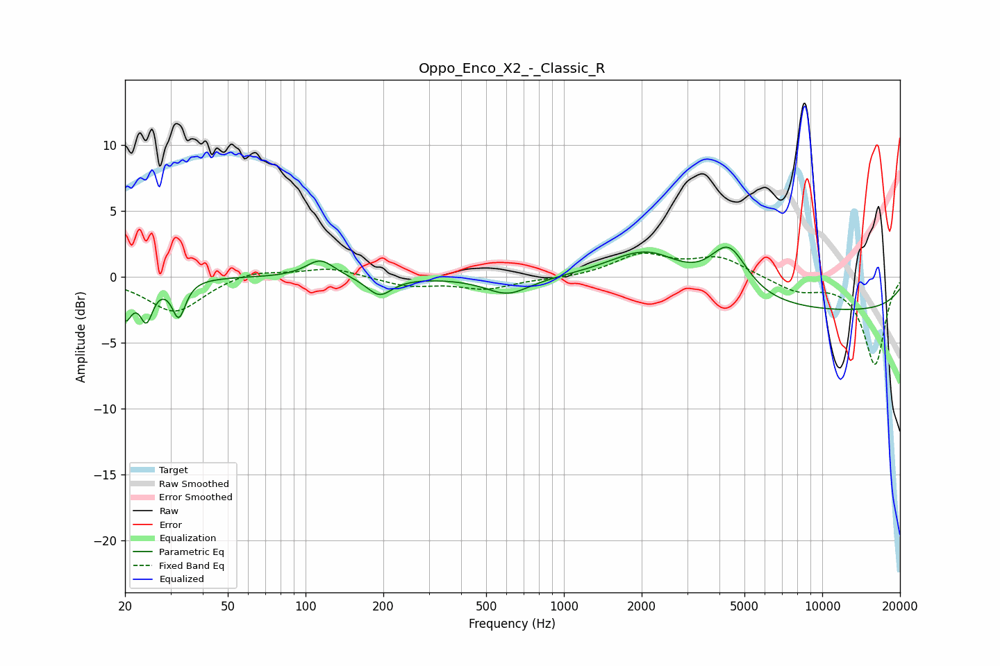

# Oppo_Enco_X2_-_Classic_R
See [usage instructions](https://github.com/jaakkopasanen/AutoEq#usage) for more options and info.

### Parametric EQs
Apply preamp of -2.4 dB when using parametric equalizer.

|   # | Type    |   Fc (Hz) |    Q |   Gain (dB) |
|-----|---------|-----------|------|-------------|
|   1 | Peaking |        20 | 5.41 |        -2.8 |
|   2 | Peaking |        24 | 5.75 |        -2.8 |
|   3 | Peaking |        32 | 5.62 |        -2.8 |
|   4 | Peaking |       114 | 2.55 |         1.4 |
|   5 | Peaking |       193 | 2.87 |        -1.4 |
|   6 | Peaking |       606 | 1.66 |        -1.3 |
|   7 | Peaking |      1969 | 0.9  |         2   |
|   8 | Peaking |      2227 | 1.25 |         1   |
|   9 | Peaking |      4342 | 1.91 |         3.7 |
|  10 | Peaking |     10000 | 0.18 |        -2.6 |

### Fixed Band EQs
When using fixed band (also called graphic) equalizer, apply preamp of **-1.9 dB** (if available) and set gains manually with these parameters.

|   # | Type    |   Fc (Hz) |    Q |   Gain (dB) |
|-----|---------|-----------|------|-------------|
|   1 | Peaking |        31 | 1.41 |        -2.7 |
|   2 | Peaking |        62 | 1.41 |         0.6 |
|   3 | Peaking |       125 | 1.41 |         0.7 |
|   4 | Peaking |       250 | 1.41 |        -0.7 |
|   5 | Peaking |       500 | 1.41 |        -0.9 |
|   6 | Peaking |      1000 | 1.41 |        -0.1 |
|   7 | Peaking |      2000 | 1.41 |         1.7 |
|   8 | Peaking |      4000 | 1.41 |         1.4 |
|   9 | Peaking |      8000 | 1.41 |        -1   |
|  10 | Peaking |     16000 | 1.41 |        -6.6 |

### Graphs

