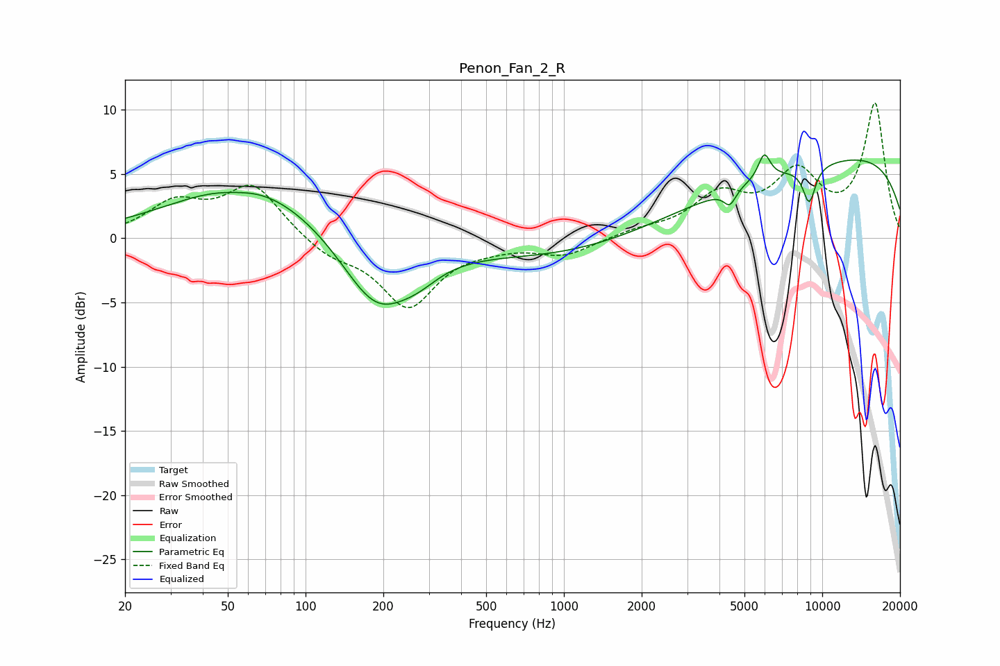

# Penon_Fan_2_R
See [usage instructions](https://github.com/jaakkopasanen/AutoEq#usage) for more options and info.

### Parametric EQs
Apply preamp of -6.6 dB when using parametric equalizer.

|   # | Type    |   Fc (Hz) |    Q |   Gain (dB) |
|-----|---------|-----------|------|-------------|
|   1 | Peaking |        57 | 1.62 |        -1.7 |
|   2 | Peaking |        57 | 1.58 |         1.6 |
|   3 | Peaking |        61 | 0.48 |         4.4 |
|   4 | Peaking |       188 | 1.01 |        -6   |
|   5 | Peaking |       274 | 1.74 |        -0.9 |
|   6 | Peaking |      2641 | 0.19 |        -2.5 |
|   7 | Peaking |      4388 | 6    |        -1.2 |
|   8 | Peaking |      5965 | 5.84 |         2   |
|   9 | Peaking |      8904 | 5.26 |        -2.8 |
|  10 | Peaking |      9800 | 0.19 |         7.3 |

### Fixed Band EQs
When using fixed band (also called graphic) equalizer, apply preamp of **-10.6 dB** (if available) and set gains manually with these parameters.

|   # | Type    |   Fc (Hz) |    Q |   Gain (dB) |
|-----|---------|-----------|------|-------------|
|   1 | Peaking |        31 | 1.41 |         2.5 |
|   2 | Peaking |        62 | 1.41 |         4   |
|   3 | Peaking |       125 | 1.41 |        -1.3 |
|   4 | Peaking |       250 | 1.41 |        -5.2 |
|   5 | Peaking |       500 | 1.41 |        -0.4 |
|   6 | Peaking |      1000 | 1.41 |        -1.3 |
|   7 | Peaking |      2000 | 1.41 |         0.5 |
|   8 | Peaking |      4000 | 1.41 |         3   |
|   9 | Peaking |      8000 | 1.41 |         4.6 |
|  10 | Peaking |     16000 | 1.41 |        10.3 |

### Graphs

