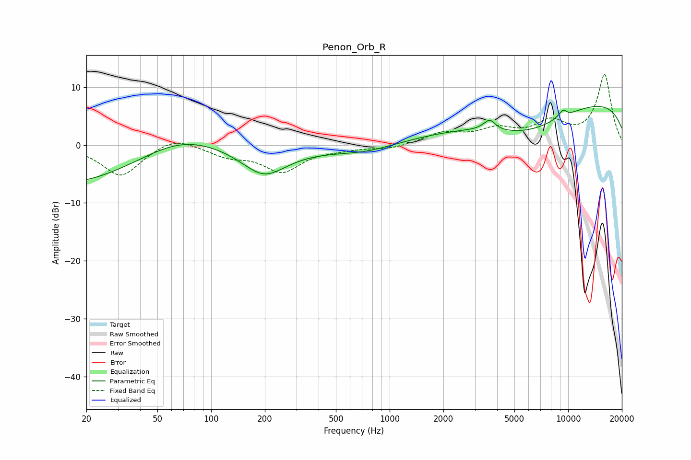

# Penon_Orb_R
See [usage instructions](https://github.com/jaakkopasanen/AutoEq#usage) for more options and info.

### Parametric EQs
Apply preamp of -6.8 dB when using parametric equalizer.

|   # | Type    |   Fc (Hz) |    Q |   Gain (dB) |
|-----|---------|-----------|------|-------------|
|   1 | Peaking |        40 | 0.18 |       -13.4 |
|   2 | Peaking |        67 | 0.35 |        13.2 |
|   3 | Peaking |       198 | 1.16 |        -4.6 |
|   4 | Peaking |       726 | 0.85 |        -1.2 |
|   5 | Peaking |      3287 | 4.67 |         0.1 |
|   6 | Peaking |      3637 | 4.64 |         1.8 |
|   7 | Peaking |      5854 | 0.54 |        -5.2 |
|   8 | Peaking |      9390 | 4.53 |         1.4 |
|   9 | Peaking |     10000 | 0.18 |         8.4 |
|  10 | Peaking |     10000 | 4.6  |        -0.4 |

### Fixed Band EQs
When using fixed band (also called graphic) equalizer, apply preamp of **-12.3 dB** (if available) and set gains manually with these parameters.

|   # | Type    |   Fc (Hz) |    Q |   Gain (dB) |
|-----|---------|-----------|------|-------------|
|   1 | Peaking |        31 | 1.41 |        -5.4 |
|   2 | Peaking |        62 | 1.41 |         1.8 |
|   3 | Peaking |       125 | 1.41 |        -1.7 |
|   4 | Peaking |       250 | 1.41 |        -4.4 |
|   5 | Peaking |       500 | 1.41 |        -0.5 |
|   6 | Peaking |      1000 | 1.41 |        -0.7 |
|   7 | Peaking |      2000 | 1.41 |         1.9 |
|   8 | Peaking |      4000 | 1.41 |         2.4 |
|   9 | Peaking |      8000 | 1.41 |         3.5 |
|  10 | Peaking |     16000 | 1.41 |        12.1 |

### Graphs

