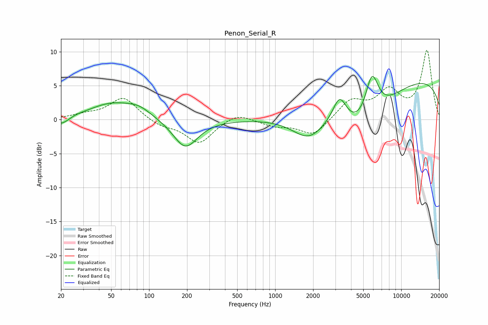

# Penon_Serial_R
See [usage instructions](https://github.com/jaakkopasanen/AutoEq#usage) for more options and info.

### Parametric EQs
Apply preamp of -6.5 dB when using parametric equalizer.

|   # | Type    |   Fc (Hz) |    Q |   Gain (dB) |
|-----|---------|-----------|------|-------------|
|   1 | Peaking |        22 | 1.41 |        -2.2 |
|   2 | Peaking |        24 | 1.78 |         1.2 |
|   3 | Peaking |        52 | 0.69 |         2.5 |
|   4 | Peaking |        84 | 1.66 |         0.8 |
|   5 | Peaking |       194 | 1.45 |        -4.3 |
|   6 | Peaking |      1847 | 1.07 |        -3.7 |
|   7 | Peaking |      3247 | 2.58 |         3.9 |
|   8 | Peaking |      4998 | 0.67 |        -6.8 |
|   9 | Peaking |      5855 | 2.53 |         6.8 |
|  10 | Peaking |      9991 | 0.18 |         6.4 |

### Fixed Band EQs
When using fixed band (also called graphic) equalizer, apply preamp of **-10.3 dB** (if available) and set gains manually with these parameters.

|   # | Type    |   Fc (Hz) |    Q |   Gain (dB) |
|-----|---------|-----------|------|-------------|
|   1 | Peaking |        31 | 1.41 |         0.6 |
|   2 | Peaking |        62 | 1.41 |         3.3 |
|   3 | Peaking |       125 | 1.41 |        -0.9 |
|   4 | Peaking |       250 | 1.41 |        -3.4 |
|   5 | Peaking |       500 | 1.41 |         1.1 |
|   6 | Peaking |      1000 | 1.41 |        -0.9 |
|   7 | Peaking |      2000 | 1.41 |        -2.4 |
|   8 | Peaking |      4000 | 1.41 |         2.8 |
|   9 | Peaking |      8000 | 1.41 |         3.9 |
|  10 | Peaking |     16000 | 1.41 |        10.1 |

### Graphs

