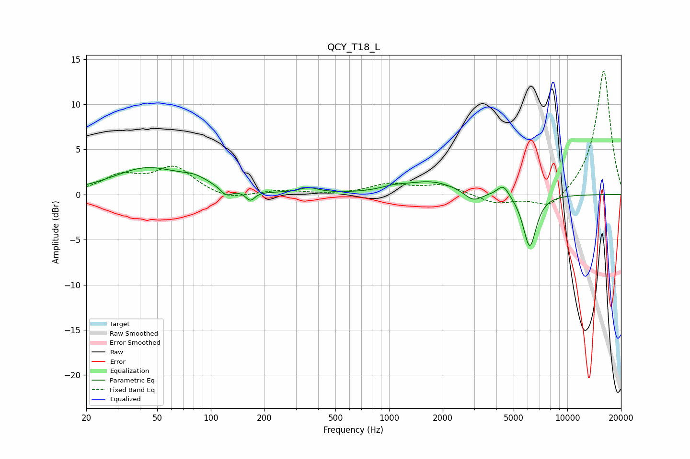

# QCY_T18_L
See [usage instructions](https://github.com/jaakkopasanen/AutoEq#usage) for more options and info.

### Parametric EQs
Apply preamp of -3.1 dB when using parametric equalizer.

|   # | Type    |   Fc (Hz) |    Q |   Gain (dB) |
|-----|---------|-----------|------|-------------|
|   1 | Peaking |        44 | 0.74 |         2.9 |
|   2 | Peaking |        82 | 1.8  |         0.8 |
|   3 | Peaking |       122 | 4.48 |        -0.9 |
|   4 | Peaking |       167 | 5.54 |        -1   |
|   5 | Peaking |       354 | 2.59 |         0.6 |
|   6 | Peaking |      1065 | 2.04 |         0.4 |
|   7 | Peaking |      1731 | 0.95 |         1.4 |
|   8 | Peaking |      2962 | 2.82 |        -1.1 |
|   9 | Peaking |      4373 | 4.13 |         1.4 |
|  10 | Peaking |      6151 | 3.7  |        -5.9 |

### Fixed Band EQs
When using fixed band (also called graphic) equalizer, apply preamp of **-13.8 dB** (if available) and set gains manually with these parameters.

|   # | Type    |   Fc (Hz) |    Q |   Gain (dB) |
|-----|---------|-----------|------|-------------|
|   1 | Peaking |        31 | 1.41 |         1.9 |
|   2 | Peaking |        62 | 1.41 |         2.9 |
|   3 | Peaking |       125 | 1.41 |        -0.7 |
|   4 | Peaking |       250 | 1.41 |         0.4 |
|   5 | Peaking |       500 | 1.41 |        -0   |
|   6 | Peaking |      1000 | 1.41 |         1.1 |
|   7 | Peaking |      2000 | 1.41 |         1   |
|   8 | Peaking |      4000 | 1.41 |        -1   |
|   9 | Peaking |      8000 | 1.41 |        -1.8 |
|  10 | Peaking |     16000 | 1.41 |        13.9 |

### Graphs

