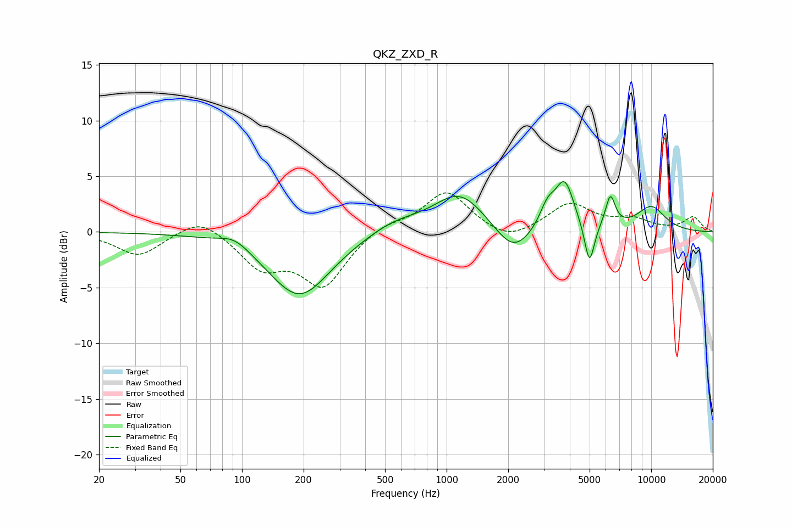

# QKZ_ZXD_R
See [usage instructions](https://github.com/jaakkopasanen/AutoEq#usage) for more options and info.

### Parametric EQs
Apply preamp of -4.6 dB when using parametric equalizer.

|   # | Type    |   Fc (Hz) |    Q |   Gain (dB) |
|-----|---------|-----------|------|-------------|
|   1 | Peaking |        92 | 1.89 |         1   |
|   2 | Peaking |       191 | 0.93 |        -5.8 |
|   3 | Peaking |       555 | 1.05 |         1.1 |
|   4 | Peaking |      1158 | 1.13 |         3.5 |
|   5 | Peaking |      2116 | 1.61 |        -2.5 |
|   6 | Peaking |      3114 | 3.59 |         1.9 |
|   7 | Peaking |      3777 | 3.07 |         4.2 |
|   8 | Peaking |      4991 | 5.75 |        -3.8 |
|   9 | Peaking |      6317 | 5.67 |         2.8 |
|  10 | Peaking |     10000 | 1.69 |         2.2 |

### Fixed Band EQs
When using fixed band (also called graphic) equalizer, apply preamp of **-3.6 dB** (if available) and set gains manually with these parameters.

|   # | Type    |   Fc (Hz) |    Q |   Gain (dB) |
|-----|---------|-----------|------|-------------|
|   1 | Peaking |        31 | 1.41 |        -2.1 |
|   2 | Peaking |        62 | 1.41 |         1.5 |
|   3 | Peaking |       125 | 1.41 |        -3   |
|   4 | Peaking |       250 | 1.41 |        -4.7 |
|   5 | Peaking |       500 | 1.41 |         0.8 |
|   6 | Peaking |      1000 | 1.41 |         3.7 |
|   7 | Peaking |      2000 | 1.41 |        -1.1 |
|   8 | Peaking |      4000 | 1.41 |         2.5 |
|   9 | Peaking |      8000 | 1.41 |         1   |
|  10 | Peaking |     16000 | 1.41 |         1.3 |

### Graphs

