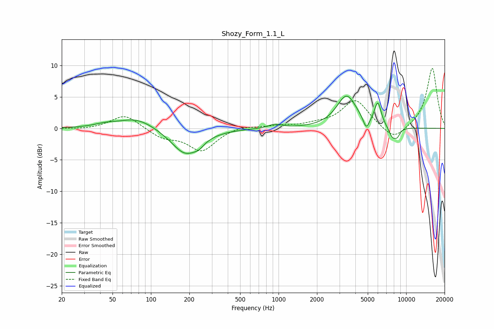

# Shozy_Form_1.1_L
See [usage instructions](https://github.com/jaakkopasanen/AutoEq#usage) for more options and info.

### Parametric EQs
Apply preamp of -5.2 dB when using parametric equalizer.

|   # | Type    |   Fc (Hz) |    Q |   Gain (dB) |
|-----|---------|-----------|------|-------------|
|   1 | Peaking |        43 | 1.79 |         0.4 |
|   2 | Peaking |        77 | 1    |         1.8 |
|   3 | Peaking |       187 | 1.27 |        -4.2 |
|   4 | Peaking |       238 | 3.8  |        -0.6 |
|   5 | Peaking |       940 | 2.87 |         0.6 |
|   6 | Peaking |      3414 | 1.8  |         5.1 |
|   7 | Peaking |      4865 | 5.88 |        -1.9 |
|   8 | Peaking |      5992 | 5.17 |         3.7 |
|   9 | Peaking |      7808 | 4.47 |        -1.7 |
|  10 | Peaking |      8519 | 6    |        -1.1 |

### Fixed Band EQs
When using fixed band (also called graphic) equalizer, apply preamp of **-9.6 dB** (if available) and set gains manually with these parameters.

|   # | Type    |   Fc (Hz) |    Q |   Gain (dB) |
|-----|---------|-----------|------|-------------|
|   1 | Peaking |        31 | 1.41 |        -0.2 |
|   2 | Peaking |        62 | 1.41 |         2.3 |
|   3 | Peaking |       125 | 1.41 |        -1.4 |
|   4 | Peaking |       250 | 1.41 |        -3.5 |
|   5 | Peaking |       500 | 1.41 |         0.5 |
|   6 | Peaking |      1000 | 1.41 |         0.4 |
|   7 | Peaking |      2000 | 1.41 |         0.5 |
|   8 | Peaking |      4000 | 1.41 |         4.5 |
|   9 | Peaking |      8000 | 1.41 |        -2.2 |
|  10 | Peaking |     16000 | 1.41 |         9.7 |

### Graphs

