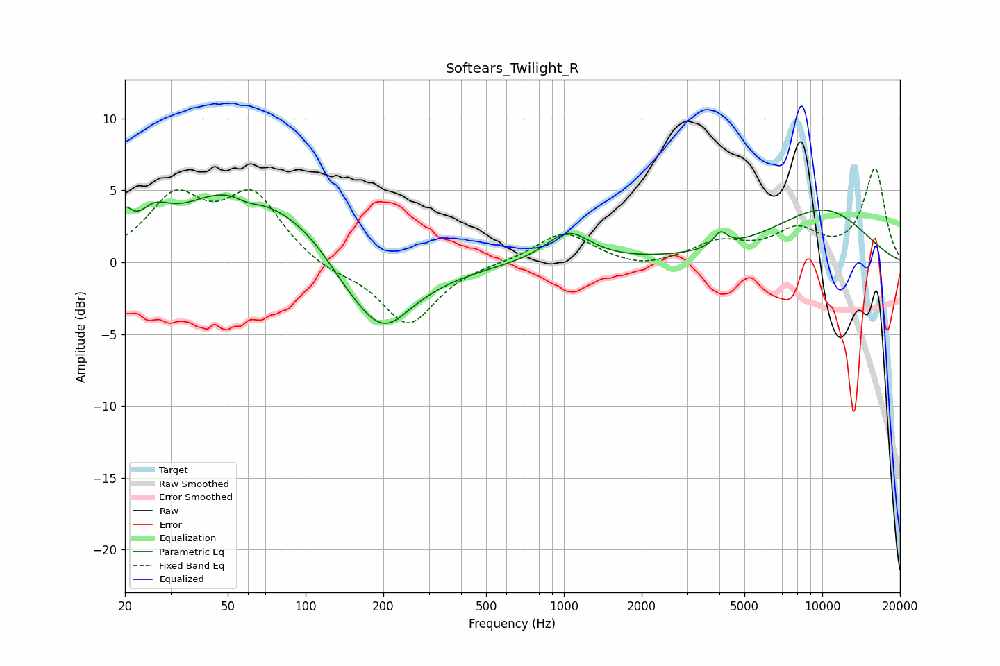

# Softears_Twilight_R
See [usage instructions](https://github.com/jaakkopasanen/AutoEq#usage) for more options and info.

### Parametric EQs
Apply preamp of -4.8 dB when using parametric equalizer.

|   # | Type    |   Fc (Hz) |    Q |   Gain (dB) |
|-----|---------|-----------|------|-------------|
|   1 | Peaking |        20 | 5.65 |         1.7 |
|   2 | Peaking |        26 | 2.31 |         1.7 |
|   3 | Peaking |        52 | 0.68 |         4.8 |
|   4 | Peaking |        60 | 2.77 |        -0.6 |
|   5 | Peaking |       106 | 0.88 |         2.6 |
|   6 | Peaking |       169 | 0.75 |        -4.7 |
|   7 | Peaking |       204 | 1.68 |        -1.7 |
|   8 | Peaking |      1038 | 1.64 |         2.1 |
|   9 | Peaking |      4040 | 5.47 |         1   |
|  10 | Peaking |     10000 | 0.61 |         3.6 |

### Fixed Band EQs
When using fixed band (also called graphic) equalizer, apply preamp of **-6.6 dB** (if available) and set gains manually with these parameters.

|   # | Type    |   Fc (Hz) |    Q |   Gain (dB) |
|-----|---------|-----------|------|-------------|
|   1 | Peaking |        31 | 1.41 |         4.2 |
|   2 | Peaking |        62 | 1.41 |         4.5 |
|   3 | Peaking |       125 | 1.41 |        -0.7 |
|   4 | Peaking |       250 | 1.41 |        -4.4 |
|   5 | Peaking |       500 | 1.41 |        -0   |
|   6 | Peaking |      1000 | 1.41 |         2.1 |
|   7 | Peaking |      2000 | 1.41 |        -0.5 |
|   8 | Peaking |      4000 | 1.41 |         1.3 |
|   9 | Peaking |      8000 | 1.41 |         2   |
|  10 | Peaking |     16000 | 1.41 |         6.5 |

### Graphs

