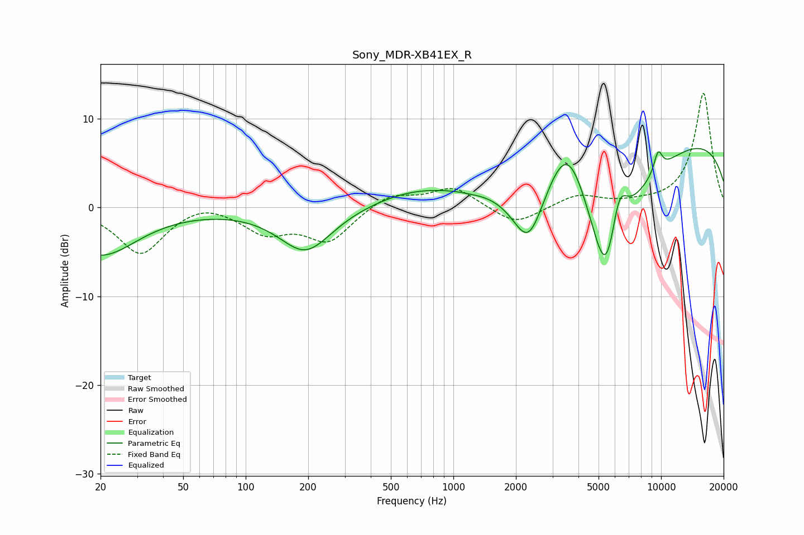

# Sony_MDR-XB41EX_R
See [usage instructions](https://github.com/jaakkopasanen/AutoEq#usage) for more options and info.

### Parametric EQs
Apply preamp of -6.8 dB when using parametric equalizer.

|   # | Type    |   Fc (Hz) |    Q |   Gain (dB) |
|-----|---------|-----------|------|-------------|
|   1 | Peaking |        20 | 0.8  |        -5.3 |
|   2 | Peaking |       194 | 1.1  |        -5.1 |
|   3 | Peaking |       663 | 0.63 |         1.8 |
|   4 | Peaking |      1205 | 4.06 |        -0.1 |
|   5 | Peaking |      2304 | 1.75 |        -7.5 |
|   6 | Peaking |      3555 | 1.3  |         8.8 |
|   7 | Peaking |      5459 | 1.18 |       -19.2 |
|   8 | Peaking |      6255 | 3.14 |         6.2 |
|   9 | Peaking |      9678 | 6    |         2.4 |
|  10 | Peaking |     10000 | 0.18 |         8.6 |

### Fixed Band EQs
When using fixed band (also called graphic) equalizer, apply preamp of **-13.0 dB** (if available) and set gains manually with these parameters.

|   # | Type    |   Fc (Hz) |    Q |   Gain (dB) |
|-----|---------|-----------|------|-------------|
|   1 | Peaking |        31 | 1.41 |        -5.2 |
|   2 | Peaking |        62 | 1.41 |         0.9 |
|   3 | Peaking |       125 | 1.41 |        -2.6 |
|   4 | Peaking |       250 | 1.41 |        -3.7 |
|   5 | Peaking |       500 | 1.41 |         1.6 |
|   6 | Peaking |      1000 | 1.41 |         2.3 |
|   7 | Peaking |      2000 | 1.41 |        -2.1 |
|   8 | Peaking |      4000 | 1.41 |         1.4 |
|   9 | Peaking |      8000 | 1.41 |         0.3 |
|  10 | Peaking |     16000 | 1.41 |        13   |

### Graphs

