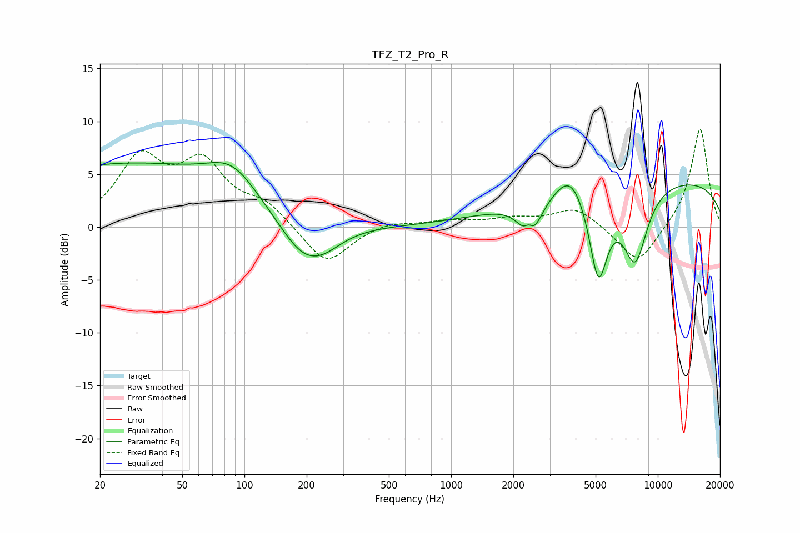

# TFZ_T2_Pro_R
See [usage instructions](https://github.com/jaakkopasanen/AutoEq#usage) for more options and info.

### Parametric EQs
Apply preamp of -6.2 dB when using parametric equalizer.

|   # | Type    |   Fc (Hz) |    Q |   Gain (dB) |
|-----|---------|-----------|------|-------------|
|   1 | Peaking |        26 | 0.25 |         5.9 |
|   2 | Peaking |        87 | 1.18 |         2.8 |
|   3 | Peaking |       191 | 1.19 |        -3.6 |
|   4 | Peaking |       243 | 1.52 |        -1.2 |
|   5 | Peaking |      2379 | 5.98 |         1.8 |
|   6 | Peaking |      2405 | 3.04 |        -4.4 |
|   7 | Peaking |      3802 | 1.9  |         2.7 |
|   8 | Peaking |      5158 | 3.02 |        -8.5 |
|   9 | Peaking |      7768 | 2.19 |        -7.1 |
|  10 | Peaking |      9721 | 0.18 |         4.6 |

### Fixed Band EQs
When using fixed band (also called graphic) equalizer, apply preamp of **-9.3 dB** (if available) and set gains manually with these parameters.

|   # | Type    |   Fc (Hz) |    Q |   Gain (dB) |
|-----|---------|-----------|------|-------------|
|   1 | Peaking |        31 | 1.41 |         6.1 |
|   2 | Peaking |        62 | 1.41 |         5.5 |
|   3 | Peaking |       125 | 1.41 |         1.9 |
|   4 | Peaking |       250 | 1.41 |        -3.7 |
|   5 | Peaking |       500 | 1.41 |         0.6 |
|   6 | Peaking |      1000 | 1.41 |         0.5 |
|   7 | Peaking |      2000 | 1.41 |         0.7 |
|   8 | Peaking |      4000 | 1.41 |         1.9 |
|   9 | Peaking |      8000 | 1.41 |        -3.7 |
|  10 | Peaking |     16000 | 1.41 |         9.4 |

### Graphs

