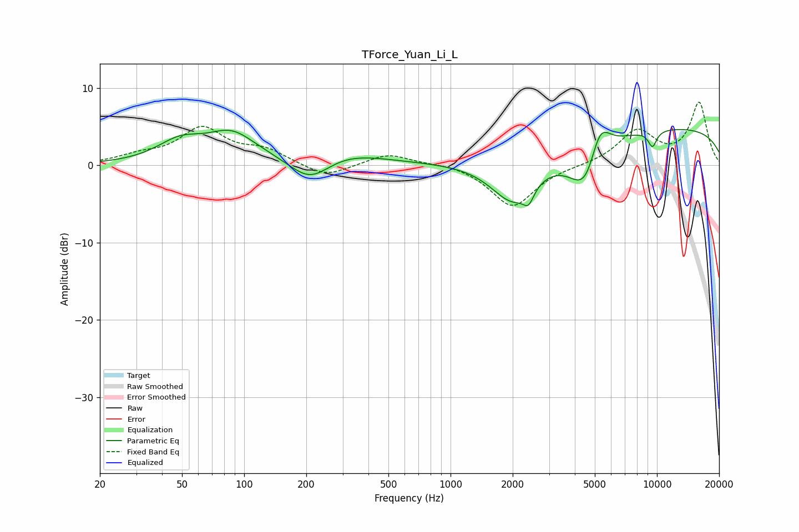

# TForce_Yuan_Li_L
See [usage instructions](https://github.com/jaakkopasanen/AutoEq#usage) for more options and info.

### Parametric EQs
Apply preamp of -4.7 dB when using parametric equalizer.

|   # | Type    |   Fc (Hz) |    Q |   Gain (dB) |
|-----|---------|-----------|------|-------------|
|   1 | Peaking |        49 | 1.25 |         2.6 |
|   2 | Peaking |        87 | 1.23 |         3.5 |
|   3 | Peaking |       209 | 1.19 |        -5.4 |
|   4 | Peaking |       235 | 0.7  |         3.7 |
|   5 | Peaking |      2012 | 1.25 |        -6.2 |
|   6 | Peaking |      2387 | 5.65 |        -1.9 |
|   7 | Peaking |      4590 | 1.67 |        -8.2 |
|   8 | Peaking |      5247 | 2.51 |         6.3 |
|   9 | Peaking |      9511 | 5.98 |        -2.1 |
|  10 | Peaking |     10000 | 0.18 |         5   |

### Fixed Band EQs
When using fixed band (also called graphic) equalizer, apply preamp of **-8.3 dB** (if available) and set gains manually with these parameters.

|   # | Type    |   Fc (Hz) |    Q |   Gain (dB) |
|-----|---------|-----------|------|-------------|
|   1 | Peaking |        31 | 1.41 |         1   |
|   2 | Peaking |        62 | 1.41 |         4.6 |
|   3 | Peaking |       125 | 1.41 |         1.8 |
|   4 | Peaking |       250 | 1.41 |        -1.7 |
|   5 | Peaking |       500 | 1.41 |         1.6 |
|   6 | Peaking |      1000 | 1.41 |         0.4 |
|   7 | Peaking |      2000 | 1.41 |        -5.4 |
|   8 | Peaking |      4000 | 1.41 |        -0   |
|   9 | Peaking |      8000 | 1.41 |         4.4 |
|  10 | Peaking |     16000 | 1.41 |         8   |

### Graphs

