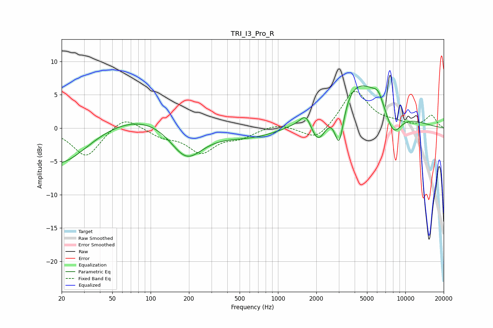

# TRI_I3_Pro_R
See [usage instructions](https://github.com/jaakkopasanen/AutoEq#usage) for more options and info.

### Parametric EQs
Apply preamp of -6.4 dB when using parametric equalizer.

|   # | Type    |   Fc (Hz) |    Q |   Gain (dB) |
|-----|---------|-----------|------|-------------|
|   1 | Peaking |        20 | 0.44 |       -11.2 |
|   2 | Peaking |        67 | 0.18 |         9.6 |
|   3 | Peaking |       190 | 1.03 |        -5.8 |
|   4 | Peaking |       195 | 0.21 |        -5.4 |
|   5 | Peaking |      1662 | 3.18 |         2.1 |
|   6 | Peaking |      2074 | 2    |        -5.4 |
|   7 | Peaking |      3024 | 3.72 |        -7   |
|   8 | Peaking |      4035 | 0.54 |         8   |
|   9 | Peaking |      6134 | 3.53 |         1.4 |
|  10 | Peaking |      8022 | 1.87 |        -4.5 |

### Fixed Band EQs
When using fixed band (also called graphic) equalizer, apply preamp of **-5.6 dB** (if available) and set gains manually with these parameters.

|   # | Type    |   Fc (Hz) |    Q |   Gain (dB) |
|-----|---------|-----------|------|-------------|
|   1 | Peaking |        31 | 1.41 |        -4.3 |
|   2 | Peaking |        62 | 1.41 |         2   |
|   3 | Peaking |       125 | 1.41 |        -1.1 |
|   4 | Peaking |       250 | 1.41 |        -3.5 |
|   5 | Peaking |       500 | 1.41 |        -1.2 |
|   6 | Peaking |      1000 | 1.41 |         0.7 |
|   7 | Peaking |      2000 | 1.41 |        -2.1 |
|   8 | Peaking |      4000 | 1.41 |         5.7 |
|   9 | Peaking |      8000 | 1.41 |         0.6 |
|  10 | Peaking |     16000 | 1.41 |         1.8 |

### Graphs

