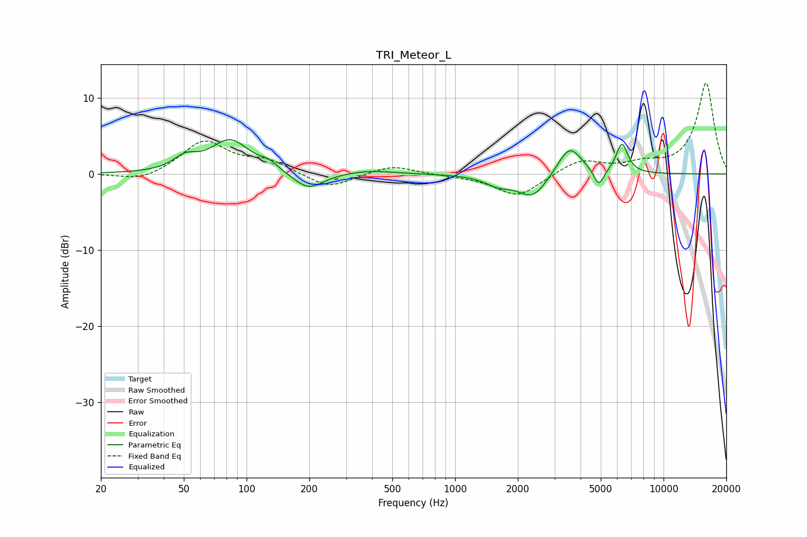

# TRI_Meteor_L
See [usage instructions](https://github.com/jaakkopasanen/AutoEq#usage) for more options and info.

### Parametric EQs
Apply preamp of -4.6 dB when using parametric equalizer.

|   # | Type    |   Fc (Hz) |    Q |   Gain (dB) |
|-----|---------|-----------|------|-------------|
|   1 | Peaking |        51 | 2.64 |         1.6 |
|   2 | Peaking |        83 | 1.5  |         4.4 |
|   3 | Peaking |       128 | 3.4  |         0.8 |
|   4 | Peaking |       198 | 1.96 |        -2.3 |
|   5 | Peaking |       388 | 1.22 |         0.5 |
|   6 | Peaking |      1615 | 2.19 |        -1.2 |
|   7 | Peaking |      2361 | 1.99 |        -3.1 |
|   8 | Peaking |      3539 | 2.42 |         4   |
|   9 | Peaking |      4894 | 5.78 |        -2.3 |
|  10 | Peaking |      6321 | 4.94 |         3.9 |

### Fixed Band EQs
When using fixed band (also called graphic) equalizer, apply preamp of **-12.1 dB** (if available) and set gains manually with these parameters.

|   # | Type    |   Fc (Hz) |    Q |   Gain (dB) |
|-----|---------|-----------|------|-------------|
|   1 | Peaking |        31 | 1.41 |        -1.1 |
|   2 | Peaking |        62 | 1.41 |         4.3 |
|   3 | Peaking |       125 | 1.41 |         1.6 |
|   4 | Peaking |       250 | 1.41 |        -2   |
|   5 | Peaking |       500 | 1.41 |         1.2 |
|   6 | Peaking |      1000 | 1.41 |        -0.2 |
|   7 | Peaking |      2000 | 1.41 |        -3   |
|   8 | Peaking |      4000 | 1.41 |         1.9 |
|   9 | Peaking |      8000 | 1.41 |         1.1 |
|  10 | Peaking |     16000 | 1.41 |        12   |

### Graphs

