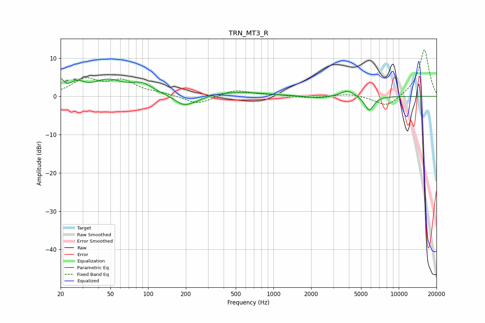

# TRN_MT3_R
See [usage instructions](https://github.com/jaakkopasanen/AutoEq#usage) for more options and info.

### Parametric EQs
Apply preamp of -4.7 dB when using parametric equalizer.

|   # | Type    |   Fc (Hz) |    Q |   Gain (dB) |
|-----|---------|-----------|------|-------------|
|   1 | Peaking |        20 | 5.96 |         3.1 |
|   2 | Peaking |        27 | 2.48 |         2.6 |
|   3 | Peaking |        48 | 1.17 |         3.8 |
|   4 | Peaking |        89 | 1.64 |         2.6 |
|   5 | Peaking |       192 | 2.01 |        -2.6 |
|   6 | Peaking |       245 | 2.27 |        -0.7 |
|   7 | Peaking |       530 | 0.7  |         1.1 |
|   8 | Peaking |      2257 | 1.81 |        -0.5 |
|   9 | Peaking |      3904 | 2.77 |         1.7 |
|  10 | Peaking |      5812 | 3.83 |        -3.8 |

### Fixed Band EQs
When using fixed band (also called graphic) equalizer, apply preamp of **-12.2 dB** (if available) and set gains manually with these parameters.

|   # | Type    |   Fc (Hz) |    Q |   Gain (dB) |
|-----|---------|-----------|------|-------------|
|   1 | Peaking |        31 | 1.41 |         4.1 |
|   2 | Peaking |        62 | 1.41 |         3.7 |
|   3 | Peaking |       125 | 1.41 |         0.6 |
|   4 | Peaking |       250 | 1.41 |        -2.2 |
|   5 | Peaking |       500 | 1.41 |         1.7 |
|   6 | Peaking |      1000 | 1.41 |         0.3 |
|   7 | Peaking |      2000 | 1.41 |        -0.4 |
|   8 | Peaking |      4000 | 1.41 |         0.7 |
|   9 | Peaking |      8000 | 1.41 |        -2.9 |
|  10 | Peaking |     16000 | 1.41 |        12.3 |

### Graphs

