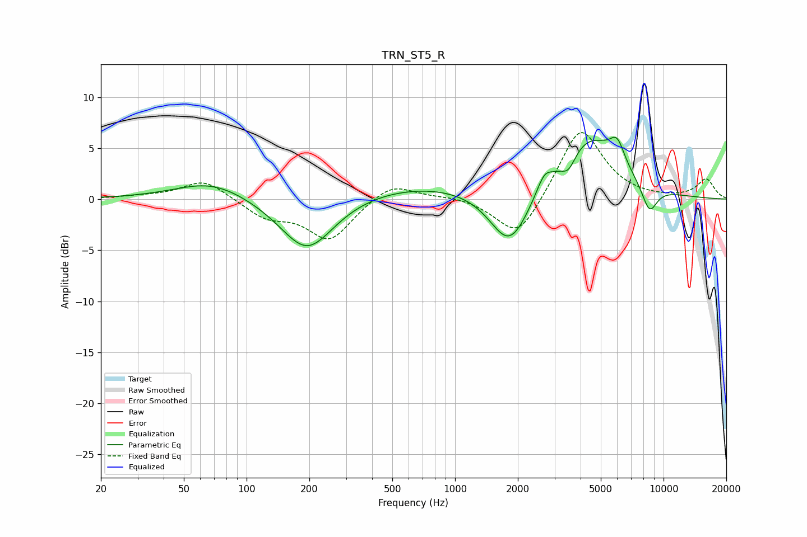

# TRN_ST5_R
See [usage instructions](https://github.com/jaakkopasanen/AutoEq#usage) for more options and info.

### Parametric EQs
Apply preamp of -6.2 dB when using parametric equalizer.

|   # | Type    |   Fc (Hz) |    Q |   Gain (dB) |
|-----|---------|-----------|------|-------------|
|   1 | Peaking |        68 | 0.82 |         1.8 |
|   2 | Peaking |       195 | 1.09 |        -5.4 |
|   3 | Peaking |       685 | 0.4  |         1.5 |
|   4 | Peaking |      1810 | 1.59 |        -1.1 |
|   5 | Peaking |      1832 | 1.47 |        -4.6 |
|   6 | Peaking |      2676 | 4.03 |         1.5 |
|   7 | Peaking |      3502 | 4.07 |        -1.6 |
|   8 | Peaking |      4377 | 0.94 |         6   |
|   9 | Peaking |      5993 | 3.82 |         2.3 |
|  10 | Peaking |      8558 | 3.4  |        -2.8 |

### Fixed Band EQs
When using fixed band (also called graphic) equalizer, apply preamp of **-6.6 dB** (if available) and set gains manually with these parameters.

|   # | Type    |   Fc (Hz) |    Q |   Gain (dB) |
|-----|---------|-----------|------|-------------|
|   1 | Peaking |        31 | 1.41 |         0.2 |
|   2 | Peaking |        62 | 1.41 |         2   |
|   3 | Peaking |       125 | 1.41 |        -1.7 |
|   4 | Peaking |       250 | 1.41 |        -3.9 |
|   5 | Peaking |       500 | 1.41 |         1.7 |
|   6 | Peaking |      1000 | 1.41 |         0.3 |
|   7 | Peaking |      2000 | 1.41 |        -4.1 |
|   8 | Peaking |      4000 | 1.41 |         7.2 |
|   9 | Peaking |      8000 | 1.41 |        -0   |
|  10 | Peaking |     16000 | 1.41 |         1.9 |

### Graphs

