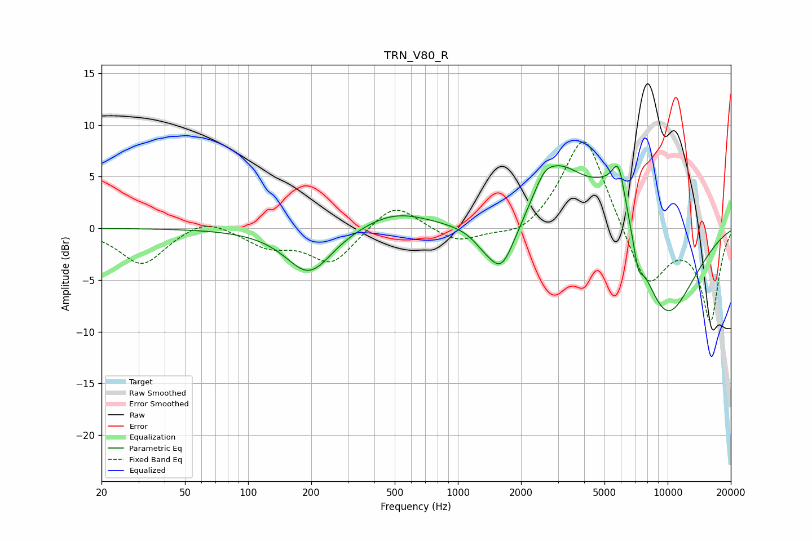

# TRN_V80_R
See [usage instructions](https://github.com/jaakkopasanen/AutoEq#usage) for more options and info.

### Parametric EQs
Apply preamp of -6.1 dB when using parametric equalizer.

|   # | Type    |   Fc (Hz) |    Q |   Gain (dB) |
|-----|---------|-----------|------|-------------|
|   1 | Peaking |       195 | 1.29 |        -4.4 |
|   2 | Peaking |       501 | 0.86 |         1.7 |
|   3 | Peaking |      1314 | 2.75 |        -0.7 |
|   4 | Peaking |      1613 | 2.08 |        -4.9 |
|   5 | Peaking |      2572 | 2.92 |         1.6 |
|   6 | Peaking |      3059 | 1.2  |         5   |
|   7 | Peaking |      5567 | 1.05 |         6.3 |
|   8 | Peaking |      5839 | 4.61 |         3.5 |
|   9 | Peaking |      7235 | 5.98 |        -2.3 |
|  10 | Peaking |      9635 | 0.79 |       -10   |

### Fixed Band EQs
When using fixed band (also called graphic) equalizer, apply preamp of **-8.5 dB** (if available) and set gains manually with these parameters.

|   # | Type    |   Fc (Hz) |    Q |   Gain (dB) |
|-----|---------|-----------|------|-------------|
|   1 | Peaking |        31 | 1.41 |        -3.5 |
|   2 | Peaking |        62 | 1.41 |         1.2 |
|   3 | Peaking |       125 | 1.41 |        -1.6 |
|   4 | Peaking |       250 | 1.41 |        -3.4 |
|   5 | Peaking |       500 | 1.41 |         2.6 |
|   6 | Peaking |      1000 | 1.41 |        -1.5 |
|   7 | Peaking |      2000 | 1.41 |        -1.2 |
|   8 | Peaking |      4000 | 1.41 |         9.6 |
|   9 | Peaking |      8000 | 1.41 |        -6   |
|  10 | Peaking |     16000 | 1.41 |        -8.9 |

### Graphs

