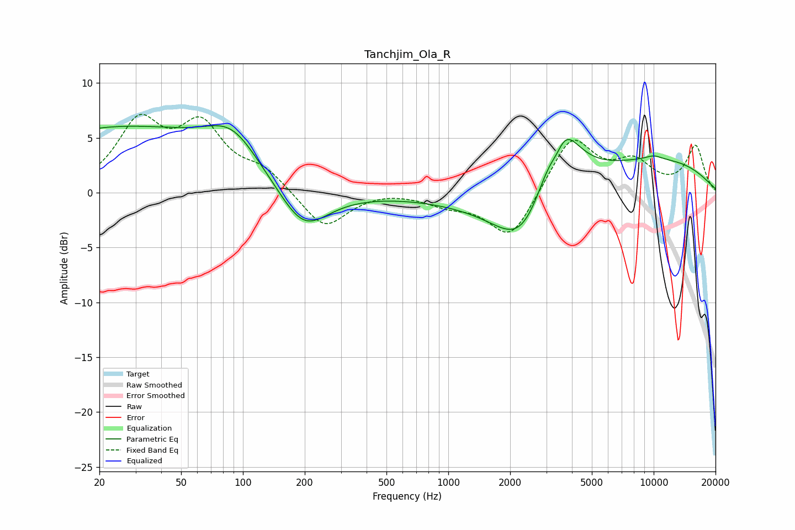

# Tanchjim_Ola_R
See [usage instructions](https://github.com/jaakkopasanen/AutoEq#usage) for more options and info.

### Parametric EQs
Apply preamp of -6.2 dB when using parametric equalizer.

|   # | Type    |   Fc (Hz) |    Q |   Gain (dB) |
|-----|---------|-----------|------|-------------|
|   1 | Peaking |        25 | 0.25 |         5.9 |
|   2 | Peaking |        89 | 1.1  |         3.2 |
|   3 | Peaking |       197 | 1.19 |        -4   |
|   4 | Peaking |       486 | 0.34 |         1.7 |
|   5 | Peaking |       762 | 0.18 |        -2.2 |
|   6 | Peaking |      2331 | 1.06 |        -5.2 |
|   7 | Peaking |      3382 | 3.28 |        -3.2 |
|   8 | Peaking |      3450 | 1.64 |         9.6 |
|   9 | Peaking |     10000 | 3.11 |         0.3 |
|  10 | Peaking |     10000 | 0.35 |         3   |

### Fixed Band EQs
When using fixed band (also called graphic) equalizer, apply preamp of **-7.2 dB** (if available) and set gains manually with these parameters.

|   # | Type    |   Fc (Hz) |    Q |   Gain (dB) |
|-----|---------|-----------|------|-------------|
|   1 | Peaking |        31 | 1.41 |         6   |
|   2 | Peaking |        62 | 1.41 |         5.5 |
|   3 | Peaking |       125 | 1.41 |         1.8 |
|   4 | Peaking |       250 | 1.41 |        -3.4 |
|   5 | Peaking |       500 | 1.41 |         0.2 |
|   6 | Peaking |      1000 | 1.41 |        -0.9 |
|   7 | Peaking |      2000 | 1.41 |        -4.3 |
|   8 | Peaking |      4000 | 1.41 |         5.1 |
|   9 | Peaking |      8000 | 1.41 |         2.5 |
|  10 | Peaking |     16000 | 1.41 |         4.2 |

### Graphs

