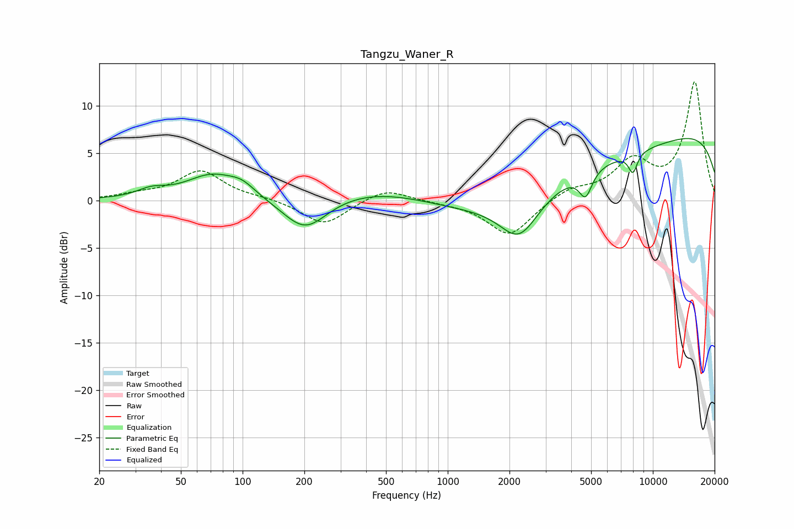

# Tangzu_Waner_R
See [usage instructions](https://github.com/jaakkopasanen/AutoEq#usage) for more options and info.

### Parametric EQs
Apply preamp of -6.6 dB when using parametric equalizer.

|   # | Type    |   Fc (Hz) |    Q |   Gain (dB) |
|-----|---------|-----------|------|-------------|
|   1 | Peaking |        36 | 2.06 |         0.8 |
|   2 | Peaking |        71 | 1.11 |         2.6 |
|   3 | Peaking |        99 | 2.22 |         1   |
|   4 | Peaking |       202 | 1.28 |        -3.7 |
|   5 | Peaking |       518 | 0.44 |         2   |
|   6 | Peaking |      2234 | 1.46 |        -4.5 |
|   7 | Peaking |      3884 | 0.18 |        -5.2 |
|   8 | Peaking |      4699 | 4.47 |        -2.6 |
|   9 | Peaking |      7992 | 5.98 |        -2.1 |
|  10 | Peaking |      9513 | 0.18 |        10   |

### Fixed Band EQs
When using fixed band (also called graphic) equalizer, apply preamp of **-12.6 dB** (if available) and set gains manually with these parameters.

|   # | Type    |   Fc (Hz) |    Q |   Gain (dB) |
|-----|---------|-----------|------|-------------|
|   1 | Peaking |        31 | 1.41 |         0.5 |
|   2 | Peaking |        62 | 1.41 |         3.1 |
|   3 | Peaking |       125 | 1.41 |         0.2 |
|   4 | Peaking |       250 | 1.41 |        -2.6 |
|   5 | Peaking |       500 | 1.41 |         1.4 |
|   6 | Peaking |      1000 | 1.41 |        -0.1 |
|   7 | Peaking |      2000 | 1.41 |        -3.8 |
|   8 | Peaking |      4000 | 1.41 |         1.2 |
|   9 | Peaking |      8000 | 1.41 |         3.9 |
|  10 | Peaking |     16000 | 1.41 |        12.4 |

### Graphs

