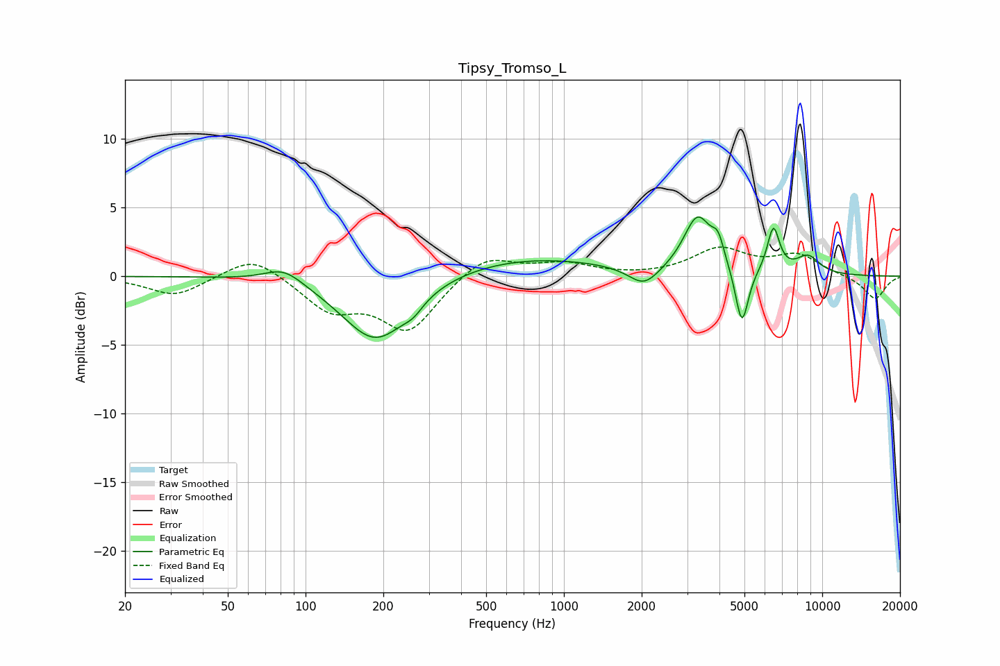

# Tipsy_Tromso_L
See [usage instructions](https://github.com/jaakkopasanen/AutoEq#usage) for more options and info.

### Parametric EQs
Apply preamp of -4.4 dB when using parametric equalizer.

|   # | Type    |   Fc (Hz) |    Q |   Gain (dB) |
|-----|---------|-----------|------|-------------|
|   1 | Peaking |        83 | 1.88 |         1.2 |
|   2 | Peaking |       187 | 1.08 |        -4.9 |
|   3 | Peaking |       261 | 3.83 |        -0.6 |
|   4 | Peaking |       699 | 0.43 |         1.4 |
|   5 | Peaking |      2041 | 2.38 |        -1.5 |
|   6 | Peaking |      3295 | 2.61 |         4.1 |
|   7 | Peaking |      3951 | 6    |         1.6 |
|   8 | Peaking |      4888 | 5.57 |        -4.3 |
|   9 | Peaking |      6471 | 5.78 |         3.3 |
|  10 | Peaking |      8795 | 2.74 |         1.3 |

### Fixed Band EQs
When using fixed band (also called graphic) equalizer, apply preamp of **-2.2 dB** (if available) and set gains manually with these parameters.

|   # | Type    |   Fc (Hz) |    Q |   Gain (dB) |
|-----|---------|-----------|------|-------------|
|   1 | Peaking |        31 | 1.41 |        -1.4 |
|   2 | Peaking |        62 | 1.41 |         1.7 |
|   3 | Peaking |       125 | 1.41 |        -2.3 |
|   4 | Peaking |       250 | 1.41 |        -3.9 |
|   5 | Peaking |       500 | 1.41 |         1.7 |
|   6 | Peaking |      1000 | 1.41 |         0.9 |
|   7 | Peaking |      2000 | 1.41 |        -0.1 |
|   8 | Peaking |      4000 | 1.41 |         1.9 |
|   9 | Peaking |      8000 | 1.41 |         1.5 |
|  10 | Peaking |     16000 | 1.41 |        -1.7 |

### Graphs

