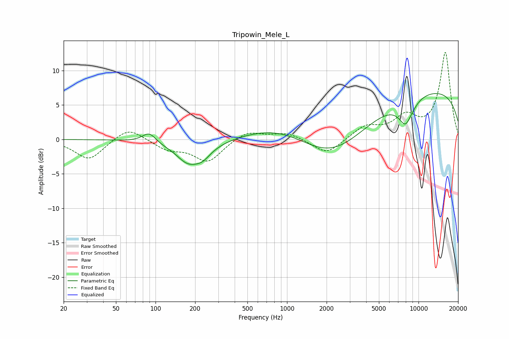

# Tripowin_Mele_L
See [usage instructions](https://github.com/jaakkopasanen/AutoEq#usage) for more options and info.

### Parametric EQs
Apply preamp of -6.8 dB when using parametric equalizer.

|   # | Type    |   Fc (Hz) |    Q |   Gain (dB) |
|-----|---------|-----------|------|-------------|
|   1 | Peaking |        90 | 2.71 |         1.6 |
|   2 | Peaking |       140 | 1.84 |         0.5 |
|   3 | Peaking |       170 | 2.44 |        -0.2 |
|   4 | Peaking |       182 | 1.1  |        -3.7 |
|   5 | Peaking |       230 | 2.79 |        -0.7 |
|   6 | Peaking |       984 | 0.51 |         3.1 |
|   7 | Peaking |      2212 | 0.48 |        -6.7 |
|   8 | Peaking |      8076 | 2.36 |        -4   |
|   9 | Peaking |      8511 | 4.52 |         0.5 |
|  10 | Peaking |     10000 | 0.18 |         7.5 |

### Fixed Band EQs
When using fixed band (also called graphic) equalizer, apply preamp of **-12.7 dB** (if available) and set gains manually with these parameters.

|   # | Type    |   Fc (Hz) |    Q |   Gain (dB) |
|-----|---------|-----------|------|-------------|
|   1 | Peaking |        31 | 1.41 |        -3   |
|   2 | Peaking |        62 | 1.41 |         1.9 |
|   3 | Peaking |       125 | 1.41 |        -1.4 |
|   4 | Peaking |       250 | 1.41 |        -3.2 |
|   5 | Peaking |       500 | 1.41 |         1.3 |
|   6 | Peaking |      1000 | 1.41 |         1   |
|   7 | Peaking |      2000 | 1.41 |        -2.3 |
|   8 | Peaking |      4000 | 1.41 |         1.8 |
|   9 | Peaking |      8000 | 1.41 |         2.9 |
|  10 | Peaking |     16000 | 1.41 |        12.6 |

### Graphs

