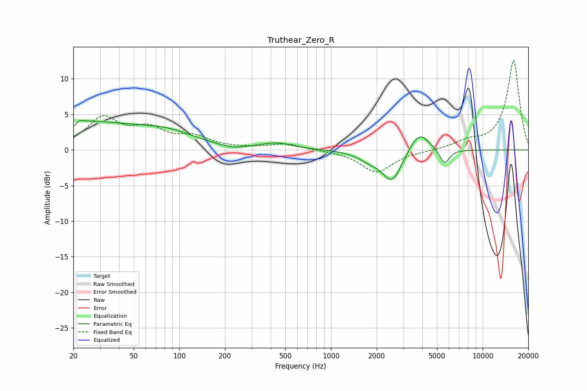

# Truthear_Zero_R
See [usage instructions](https://github.com/jaakkopasanen/AutoEq#usage) for more options and info.

### Parametric EQs
Apply preamp of -4.2 dB when using parametric equalizer.

|   # | Type    |   Fc (Hz) |    Q |   Gain (dB) |
|-----|---------|-----------|------|-------------|
|   1 | Peaking |        21 | 5.99 |        -3   |
|   2 | Peaking |        21 | 0.31 |         3.9 |
|   3 | Peaking |        21 | 5.63 |         2.5 |
|   4 | Peaking |        85 | 0.79 |         1.5 |
|   5 | Peaking |       223 | 1.85 |        -0.4 |
|   6 | Peaking |       438 | 1.33 |         0.9 |
|   7 | Peaking |      1800 | 1.91 |        -1   |
|   8 | Peaking |      2533 | 2.2  |        -4.4 |
|   9 | Peaking |      3812 | 2.1  |         3   |
|  10 | Peaking |      5599 | 4.21 |        -2.2 |

### Fixed Band EQs
When using fixed band (also called graphic) equalizer, apply preamp of **-12.7 dB** (if available) and set gains manually with these parameters.

|   # | Type    |   Fc (Hz) |    Q |   Gain (dB) |
|-----|---------|-----------|------|-------------|
|   1 | Peaking |        31 | 1.41 |         4.3 |
|   2 | Peaking |        62 | 1.41 |         2.5 |
|   3 | Peaking |       125 | 1.41 |         1.6 |
|   4 | Peaking |       250 | 1.41 |         0.1 |
|   5 | Peaking |       500 | 1.41 |         0.9 |
|   6 | Peaking |      1000 | 1.41 |        -0   |
|   7 | Peaking |      2000 | 1.41 |        -3.1 |
|   8 | Peaking |      4000 | 1.41 |        -0.1 |
|   9 | Peaking |      8000 | 1.41 |         1   |
|  10 | Peaking |     16000 | 1.41 |        12.6 |

### Graphs

