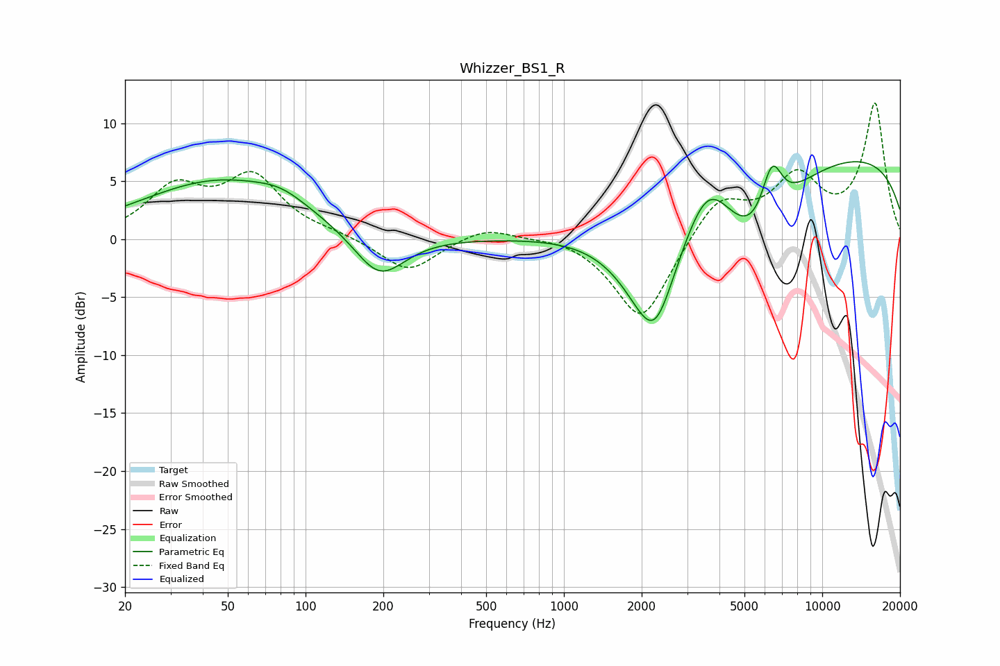

# Whizzer_BS1_R
See [usage instructions](https://github.com/jaakkopasanen/AutoEq#usage) for more options and info.

### Parametric EQs
Apply preamp of -6.8 dB when using parametric equalizer.

|   # | Type    |   Fc (Hz) |    Q |   Gain (dB) |
|-----|---------|-----------|------|-------------|
|   1 | Peaking |        47 | 0.45 |         5   |
|   2 | Peaking |        81 | 1.5  |         0.9 |
|   3 | Peaking |       193 | 1.43 |        -4   |
|   4 | Peaking |      2176 | 1.16 |        -8.9 |
|   5 | Peaking |      2278 | 2.39 |        -2.3 |
|   6 | Peaking |      3606 | 1.58 |         4.6 |
|   7 | Peaking |      5524 | 0.97 |        -6.8 |
|   8 | Peaking |      6297 | 2.53 |         0.9 |
|   9 | Peaking |      6392 | 3.39 |         4.2 |
|  10 | Peaking |      9735 | 0.18 |         7.7 |

### Fixed Band EQs
When using fixed band (also called graphic) equalizer, apply preamp of **-11.8 dB** (if available) and set gains manually with these parameters.

|   # | Type    |   Fc (Hz) |    Q |   Gain (dB) |
|-----|---------|-----------|------|-------------|
|   1 | Peaking |        31 | 1.41 |         4.1 |
|   2 | Peaking |        62 | 1.41 |         5.1 |
|   3 | Peaking |       125 | 1.41 |         0.3 |
|   4 | Peaking |       250 | 1.41 |        -2.9 |
|   5 | Peaking |       500 | 1.41 |         1.2 |
|   6 | Peaking |      1000 | 1.41 |         0.4 |
|   7 | Peaking |      2000 | 1.41 |        -7.3 |
|   8 | Peaking |      4000 | 1.41 |         3.6 |
|   9 | Peaking |      8000 | 1.41 |         5   |
|  10 | Peaking |     16000 | 1.41 |        11.5 |

### Graphs

