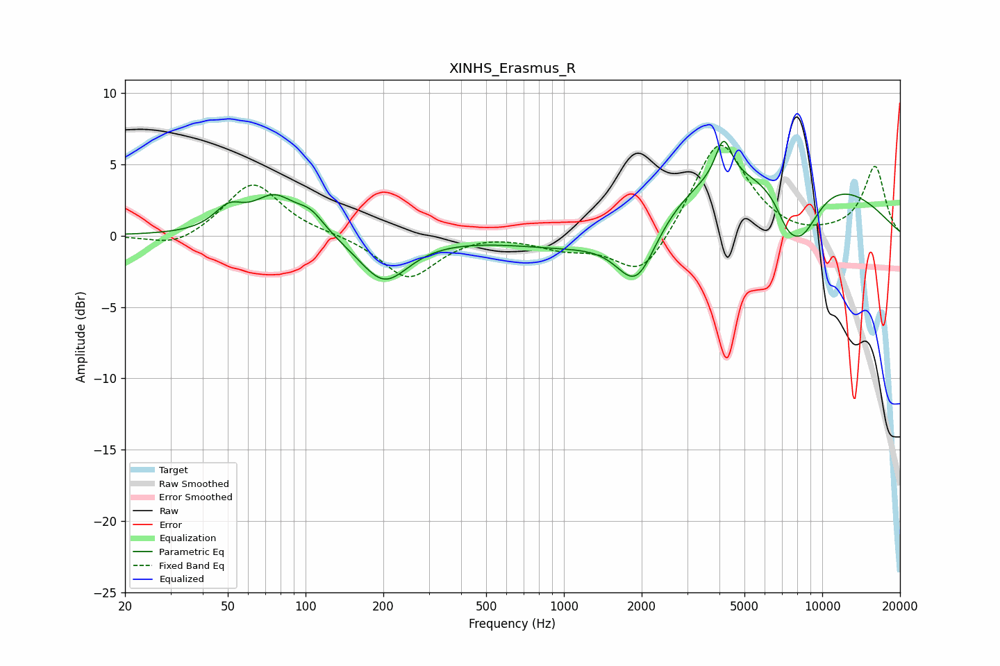

# XINHS_Erasmus_R
See [usage instructions](https://github.com/jaakkopasanen/AutoEq#usage) for more options and info.

### Parametric EQs
Apply preamp of -6.7 dB when using parametric equalizer.

|   # | Type    |   Fc (Hz) |    Q |   Gain (dB) |
|-----|---------|-----------|------|-------------|
|   1 | Peaking |        50 | 2.52 |         1.5 |
|   2 | Peaking |        76 | 1.72 |         2.5 |
|   3 | Peaking |       105 | 2.48 |         1.3 |
|   4 | Peaking |       201 | 1.49 |        -3.2 |
|   5 | Peaking |      1250 | 0.58 |        -2.1 |
|   6 | Peaking |      1913 | 1.74 |        -4.7 |
|   7 | Peaking |      4151 | 4.53 |         2.8 |
|   8 | Peaking |      5536 | 0.25 |         5.5 |
|   9 | Peaking |      7295 | 3.36 |        -1.1 |
|  10 | Peaking |      8227 | 1.64 |        -4.5 |

### Fixed Band EQs
When using fixed band (also called graphic) equalizer, apply preamp of **-6.4 dB** (if available) and set gains manually with these parameters.

|   # | Type    |   Fc (Hz) |    Q |   Gain (dB) |
|-----|---------|-----------|------|-------------|
|   1 | Peaking |        31 | 1.41 |        -0.9 |
|   2 | Peaking |        62 | 1.41 |         3.8 |
|   3 | Peaking |       125 | 1.41 |         0.1 |
|   4 | Peaking |       250 | 1.41 |        -3   |
|   5 | Peaking |       500 | 1.41 |         0.2 |
|   6 | Peaking |      1000 | 1.41 |        -0.8 |
|   7 | Peaking |      2000 | 1.41 |        -3.1 |
|   8 | Peaking |      4000 | 1.41 |         6.9 |
|   9 | Peaking |      8000 | 1.41 |        -0.3 |
|  10 | Peaking |     16000 | 1.41 |         4.8 |

### Graphs

