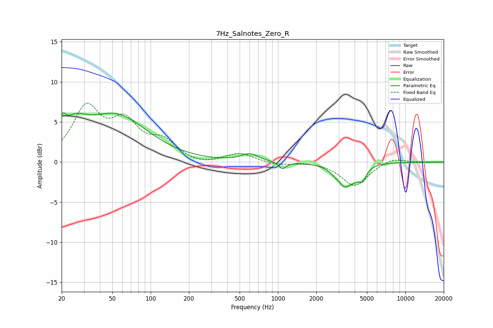

# 7Hz_Salnotes_Zero_R
See [usage instructions](https://github.com/jaakkopasanen/AutoEq#usage) for more options and info.

### Parametric EQs
Apply preamp of -6.3 dB when using parametric equalizer.

|   # | Type    |   Fc (Hz) |    Q |   Gain (dB) |
|-----|---------|-----------|------|-------------|
|   1 | Peaking |        20 | 5.71 |         2   |
|   2 | Peaking |        25 | 1.55 |         2.8 |
|   3 | Peaking |        53 | 0.58 |         5.7 |
|   4 | Peaking |       599 | 2.16 |         0.9 |
|   5 | Peaking |      1083 | 5.18 |        -0.8 |
|   6 | Peaking |      1236 | 2.65 |        -0   |
|   7 | Peaking |      3054 | 5.76 |         0.5 |
|   8 | Peaking |      3197 | 2.45 |        -2.9 |
|   9 | Peaking |      3922 | 3.07 |        -1   |
|  10 | Peaking |      4612 | 4.81 |        -1.4 |

### Fixed Band EQs
When using fixed band (also called graphic) equalizer, apply preamp of **-7.4 dB** (if available) and set gains manually with these parameters.

|   # | Type    |   Fc (Hz) |    Q |   Gain (dB) |
|-----|---------|-----------|------|-------------|
|   1 | Peaking |        31 | 1.41 |         6.4 |
|   2 | Peaking |        62 | 1.41 |         4.3 |
|   3 | Peaking |       125 | 1.41 |         2.2 |
|   4 | Peaking |       250 | 1.41 |        -0.5 |
|   5 | Peaking |       500 | 1.41 |         1.1 |
|   6 | Peaking |      1000 | 1.41 |        -0.4 |
|   7 | Peaking |      2000 | 1.41 |         0.1 |
|   8 | Peaking |      4000 | 1.41 |        -3   |
|   9 | Peaking |      8000 | 1.41 |         0.6 |
|  10 | Peaking |     16000 | 1.41 |        -0   |

### Graphs

