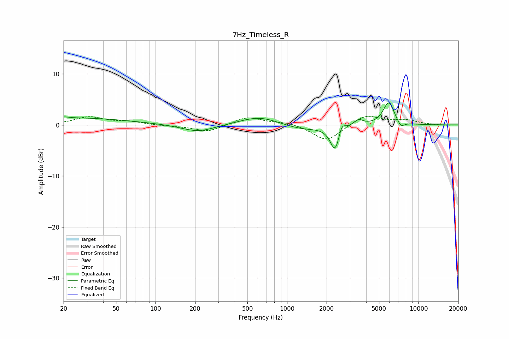

# 7Hz_Timeless_R
See [usage instructions](https://github.com/jaakkopasanen/AutoEq#usage) for more options and info.

### Parametric EQs
Apply preamp of -4.4 dB when using parametric equalizer.

|   # | Type    |   Fc (Hz) |    Q |   Gain (dB) |
|-----|---------|-----------|------|-------------|
|   1 | Peaking |        20 | 5.48 |         0.2 |
|   2 | Peaking |        21 | 0.29 |         1.4 |
|   3 | Peaking |       210 | 1.13 |        -1.5 |
|   4 | Peaking |       615 | 0.97 |         1.7 |
|   5 | Peaking |      1307 | 0.95 |        -1   |
|   6 | Peaking |      2319 | 3.92 |        -4.9 |
|   7 | Peaking |      2614 | 6    |         2   |
|   8 | Peaking |      3489 | 4.09 |         1.2 |
|   9 | Peaking |      5936 | 3.23 |         4.5 |
|  10 | Peaking |      7326 | 4.78 |        -1.3 |

### Fixed Band EQs
When using fixed band (also called graphic) equalizer, apply preamp of **-1.8 dB** (if available) and set gains manually with these parameters.

|   # | Type    |   Fc (Hz) |    Q |   Gain (dB) |
|-----|---------|-----------|------|-------------|
|   1 | Peaking |        31 | 1.41 |         1.5 |
|   2 | Peaking |        62 | 1.41 |         0.6 |
|   3 | Peaking |       125 | 1.41 |        -0.2 |
|   4 | Peaking |       250 | 1.41 |        -1.4 |
|   5 | Peaking |       500 | 1.41 |         1.6 |
|   6 | Peaking |      1000 | 1.41 |         0.6 |
|   7 | Peaking |      2000 | 1.41 |        -3.3 |
|   8 | Peaking |      4000 | 1.41 |         2.1 |
|   9 | Peaking |      8000 | 1.41 |         0.9 |
|  10 | Peaking |     16000 | 1.41 |        -0.1 |

### Graphs

