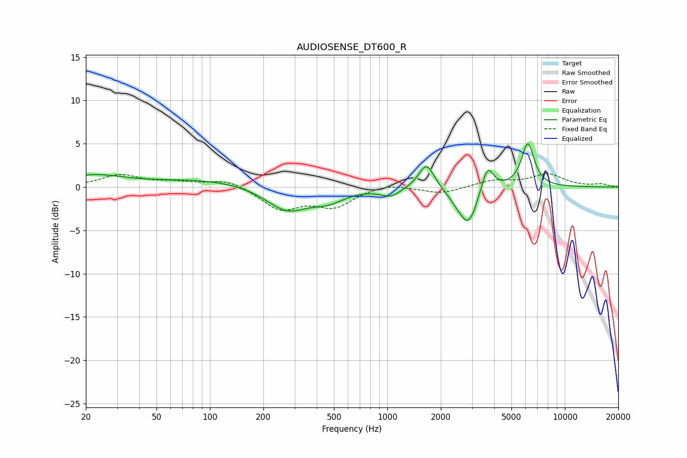

# AUDIOSENSE_DT600_R
See [usage instructions](https://github.com/jaakkopasanen/AutoEq#usage) for more options and info.

### Parametric EQs
Apply preamp of -5.1 dB when using parametric equalizer.

|   # | Type    |   Fc (Hz) |    Q |   Gain (dB) |
|-----|---------|-----------|------|-------------|
|   1 | Peaking |        22 | 0.82 |         1.3 |
|   2 | Peaking |        96 | 0.5  |         0.8 |
|   3 | Peaking |       272 | 1.19 |        -2.8 |
|   4 | Peaking |       466 | 1.55 |        -1.2 |
|   5 | Peaking |      1041 | 2.55 |        -1   |
|   6 | Peaking |      1660 | 3.2  |         3   |
|   7 | Peaking |      2495 | 2.61 |        -1.1 |
|   8 | Peaking |      2879 | 2.96 |        -3.8 |
|   9 | Peaking |      3668 | 4.34 |         2.9 |
|  10 | Peaking |      6187 | 3.85 |         5   |

### Fixed Band EQs
When using fixed band (also called graphic) equalizer, apply preamp of **-1.6 dB** (if available) and set gains manually with these parameters.

|   # | Type    |   Fc (Hz) |    Q |   Gain (dB) |
|-----|---------|-----------|------|-------------|
|   1 | Peaking |        31 | 1.41 |         1.4 |
|   2 | Peaking |        62 | 1.41 |         0.5 |
|   3 | Peaking |       125 | 1.41 |         0.9 |
|   4 | Peaking |       250 | 1.41 |        -2.5 |
|   5 | Peaking |       500 | 1.41 |        -2.1 |
|   6 | Peaking |      1000 | 1.41 |         0.5 |
|   7 | Peaking |      2000 | 1.41 |        -0.8 |
|   8 | Peaking |      4000 | 1.41 |         0.7 |
|   9 | Peaking |      8000 | 1.41 |         1.4 |
|  10 | Peaking |     16000 | 1.41 |         0.3 |

### Graphs

