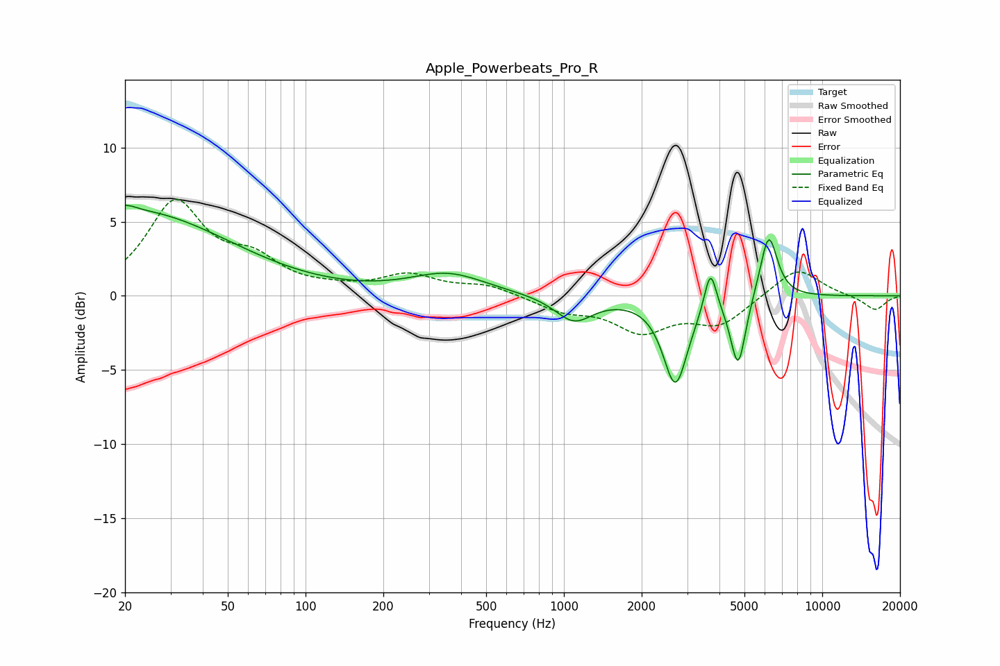

# Apple_Powerbeats_Pro_R
See [usage instructions](https://github.com/jaakkopasanen/AutoEq#usage) for more options and info.

### Parametric EQs
Apply preamp of -6.2 dB when using parametric equalizer.

|   # | Type    |   Fc (Hz) |    Q |   Gain (dB) |
|-----|---------|-----------|------|-------------|
|   1 | Peaking |        20 | 5.43 |         3.5 |
|   2 | Peaking |        20 | 0.4  |         4.9 |
|   3 | Peaking |        20 | 5.82 |        -3.1 |
|   4 | Peaking |        34 | 0.41 |         0.9 |
|   5 | Peaking |       356 | 0.97 |         1.4 |
|   6 | Peaking |      1093 | 1.94 |        -1.7 |
|   7 | Peaking |      2702 | 2.99 |        -5.9 |
|   8 | Peaking |      3691 | 6    |         3   |
|   9 | Peaking |      4726 | 4.77 |        -4.8 |
|  10 | Peaking |      6205 | 4.09 |         4.4 |

### Fixed Band EQs
When using fixed band (also called graphic) equalizer, apply preamp of **-6.6 dB** (if available) and set gains manually with these parameters.

|   # | Type    |   Fc (Hz) |    Q |   Gain (dB) |
|-----|---------|-----------|------|-------------|
|   1 | Peaking |        31 | 1.41 |         6.1 |
|   2 | Peaking |        62 | 1.41 |         2   |
|   3 | Peaking |       125 | 1.41 |         0.3 |
|   4 | Peaking |       250 | 1.41 |         1.3 |
|   5 | Peaking |       500 | 1.41 |         0.7 |
|   6 | Peaking |      1000 | 1.41 |        -0.9 |
|   7 | Peaking |      2000 | 1.41 |        -2.2 |
|   8 | Peaking |      4000 | 1.41 |        -1.8 |
|   9 | Peaking |      8000 | 1.41 |         2   |
|  10 | Peaking |     16000 | 1.41 |        -1   |

### Graphs

