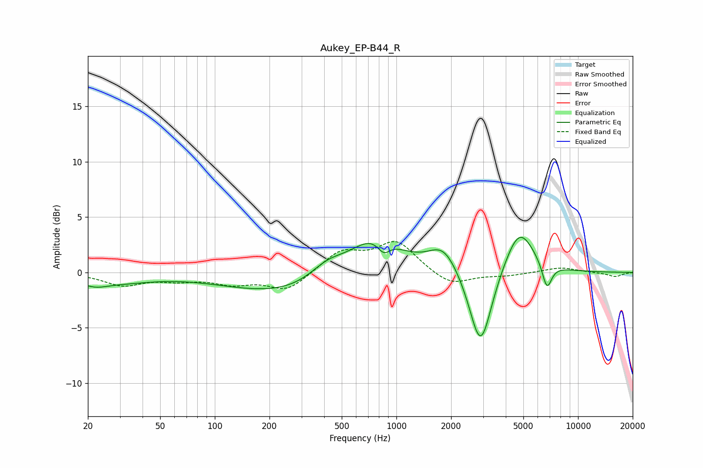

# Aukey_EP-B44_R
See [usage instructions](https://github.com/jaakkopasanen/AutoEq#usage) for more options and info.

### Parametric EQs
Apply preamp of -3.3 dB when using parametric equalizer.

|   # | Type    |   Fc (Hz) |    Q |   Gain (dB) |
|-----|---------|-----------|------|-------------|
|   1 | Peaking |        22 | 1.72 |        -0.8 |
|   2 | Peaking |        32 | 0.83 |        -0.6 |
|   3 | Peaking |       296 | 0.37 |        -2.2 |
|   4 | Peaking |       416 | 1.37 |         1.6 |
|   5 | Peaking |       760 | 0.94 |         3.9 |
|   6 | Peaking |       851 | 4.03 |        -1.2 |
|   7 | Peaking |      1818 | 1.71 |         2.3 |
|   8 | Peaking |      2906 | 2.26 |        -7.5 |
|   9 | Peaking |      4748 | 1.7  |         4.2 |
|  10 | Peaking |      6744 | 5.11 |        -2.4 |

### Fixed Band EQs
When using fixed band (also called graphic) equalizer, apply preamp of **-2.9 dB** (if available) and set gains manually with these parameters.

|   # | Type    |   Fc (Hz) |    Q |   Gain (dB) |
|-----|---------|-----------|------|-------------|
|   1 | Peaking |        31 | 1.41 |        -1.1 |
|   2 | Peaking |        62 | 1.41 |        -0.6 |
|   3 | Peaking |       125 | 1.41 |        -0.9 |
|   4 | Peaking |       250 | 1.41 |        -1.6 |
|   5 | Peaking |       500 | 1.41 |         1.9 |
|   6 | Peaking |      1000 | 1.41 |         2.7 |
|   7 | Peaking |      2000 | 1.41 |        -1.3 |
|   8 | Peaking |      4000 | 1.41 |        -0.3 |
|   9 | Peaking |      8000 | 1.41 |         0.5 |
|  10 | Peaking |     16000 | 1.41 |        -0.4 |

### Graphs

