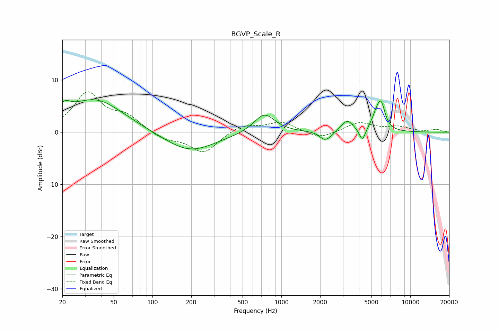

# BGVP_Scale_R
See [usage instructions](https://github.com/jaakkopasanen/AutoEq#usage) for more options and info.

### Parametric EQs
Apply preamp of -6.3 dB when using parametric equalizer.

|   # | Type    |   Fc (Hz) |    Q |   Gain (dB) |
|-----|---------|-----------|------|-------------|
|   1 | Peaking |        21 | 3.17 |         2   |
|   2 | Peaking |        36 | 0.64 |         6.3 |
|   3 | Peaking |       194 | 0.72 |        -3.8 |
|   4 | Peaking |       738 | 1.74 |         3.7 |
|   5 | Peaking |      2143 | 3.85 |        -1.3 |
|   6 | Peaking |      2380 | 3.61 |        -0.7 |
|   7 | Peaking |      3239 | 3.09 |         2.2 |
|   8 | Peaking |      4249 | 5.92 |        -2.5 |
|   9 | Peaking |      5473 | 3.78 |         2.6 |
|  10 | Peaking |      5958 | 4.65 |         4.2 |

### Fixed Band EQs
When using fixed band (also called graphic) equalizer, apply preamp of **-7.8 dB** (if available) and set gains manually with these parameters.

|   # | Type    |   Fc (Hz) |    Q |   Gain (dB) |
|-----|---------|-----------|------|-------------|
|   1 | Peaking |        31 | 1.41 |         7.3 |
|   2 | Peaking |        62 | 1.41 |         2.7 |
|   3 | Peaking |       125 | 1.41 |        -1.4 |
|   4 | Peaking |       250 | 1.41 |        -4   |
|   5 | Peaking |       500 | 1.41 |         1.5 |
|   6 | Peaking |      1000 | 1.41 |         1.9 |
|   7 | Peaking |      2000 | 1.41 |        -1.4 |
|   8 | Peaking |      4000 | 1.41 |         1.8 |
|   9 | Peaking |      8000 | 1.41 |         0.9 |
|  10 | Peaking |     16000 | 1.41 |         0.5 |

### Graphs

