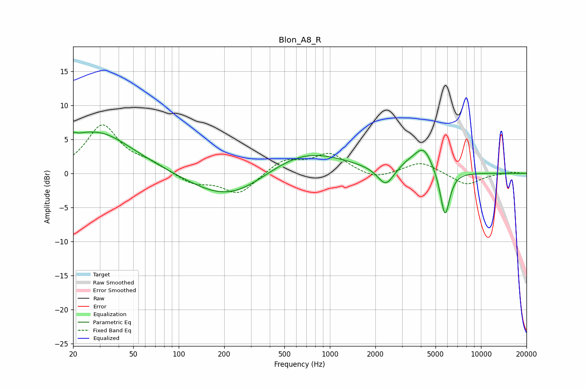

# Blon_A8_R
See [usage instructions](https://github.com/jaakkopasanen/AutoEq#usage) for more options and info.

### Parametric EQs
Apply preamp of -6.2 dB when using parametric equalizer.

|   # | Type    |   Fc (Hz) |    Q |   Gain (dB) |
|-----|---------|-----------|------|-------------|
|   1 | Peaking |        21 | 5.83 |         3.2 |
|   2 | Peaking |        21 | 5.84 |        -2.9 |
|   3 | Peaking |        23 | 0.42 |         5.2 |
|   4 | Peaking |        32 | 0.97 |         1.3 |
|   5 | Peaking |       218 | 0.57 |        -4.2 |
|   6 | Peaking |       665 | 0.53 |         3.7 |
|   7 | Peaking |      2343 | 2.66 |        -2.8 |
|   8 | Peaking |      3292 | 1.94 |         1   |
|   9 | Peaking |      4170 | 2.34 |         3.4 |
|  10 | Peaking |      5779 | 4.37 |        -6.9 |

### Fixed Band EQs
When using fixed band (also called graphic) equalizer, apply preamp of **-7.2 dB** (if available) and set gains manually with these parameters.

|   # | Type    |   Fc (Hz) |    Q |   Gain (dB) |
|-----|---------|-----------|------|-------------|
|   1 | Peaking |        31 | 1.41 |         7   |
|   2 | Peaking |        62 | 1.41 |         1.2 |
|   3 | Peaking |       125 | 1.41 |        -1.5 |
|   4 | Peaking |       250 | 1.41 |        -3.1 |
|   5 | Peaking |       500 | 1.41 |         2   |
|   6 | Peaking |      1000 | 1.41 |         2.8 |
|   7 | Peaking |      2000 | 1.41 |        -1   |
|   8 | Peaking |      4000 | 1.41 |         1.7 |
|   9 | Peaking |      8000 | 1.41 |        -1.8 |
|  10 | Peaking |     16000 | 1.41 |         0.2 |

### Graphs

