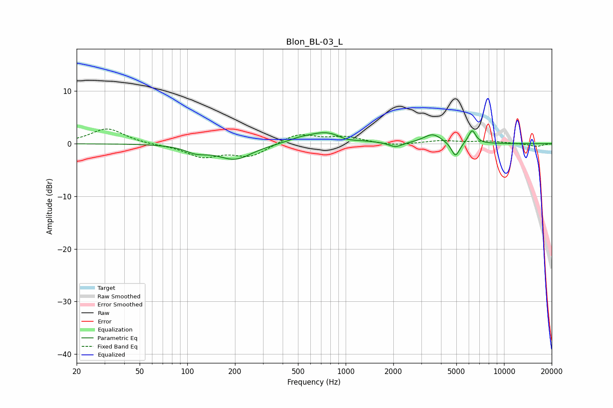

# Blon_BL-03_L
See [usage instructions](https://github.com/jaakkopasanen/AutoEq#usage) for more options and info.

### Parametric EQs
Apply preamp of -2.5 dB when using parametric equalizer.

|   # | Type    |   Fc (Hz) |    Q |   Gain (dB) |
|-----|---------|-----------|------|-------------|
|   1 | Peaking |       113 | 2.22 |        -1   |
|   2 | Peaking |       124 | 1.68 |        -0.3 |
|   3 | Peaking |       200 | 1.32 |        -2.9 |
|   4 | Peaking |       506 | 2.05 |         0.5 |
|   5 | Peaking |       764 | 1.16 |         2.3 |
|   6 | Peaking |      1004 | 2.39 |        -0.7 |
|   7 | Peaking |      2066 | 3.33 |        -0.9 |
|   8 | Peaking |      3541 | 2.47 |         1.8 |
|   9 | Peaking |      4937 | 5.37 |        -2.8 |
|  10 | Peaking |      6283 | 5.87 |         2.6 |

### Fixed Band EQs
When using fixed band (also called graphic) equalizer, apply preamp of **-2.9 dB** (if available) and set gains manually with these parameters.

|   # | Type    |   Fc (Hz) |    Q |   Gain (dB) |
|-----|---------|-----------|------|-------------|
|   1 | Peaking |        31 | 1.41 |         2.9 |
|   2 | Peaking |        62 | 1.41 |        -0.2 |
|   3 | Peaking |       125 | 1.41 |        -2.4 |
|   4 | Peaking |       250 | 1.41 |        -2.3 |
|   5 | Peaking |       500 | 1.41 |         1.9 |
|   6 | Peaking |      1000 | 1.41 |         1.2 |
|   7 | Peaking |      2000 | 1.41 |        -0.4 |
|   8 | Peaking |      4000 | 1.41 |         0.6 |
|   9 | Peaking |      8000 | 1.41 |         0.5 |
|  10 | Peaking |     16000 | 1.41 |        -0.5 |

### Graphs

