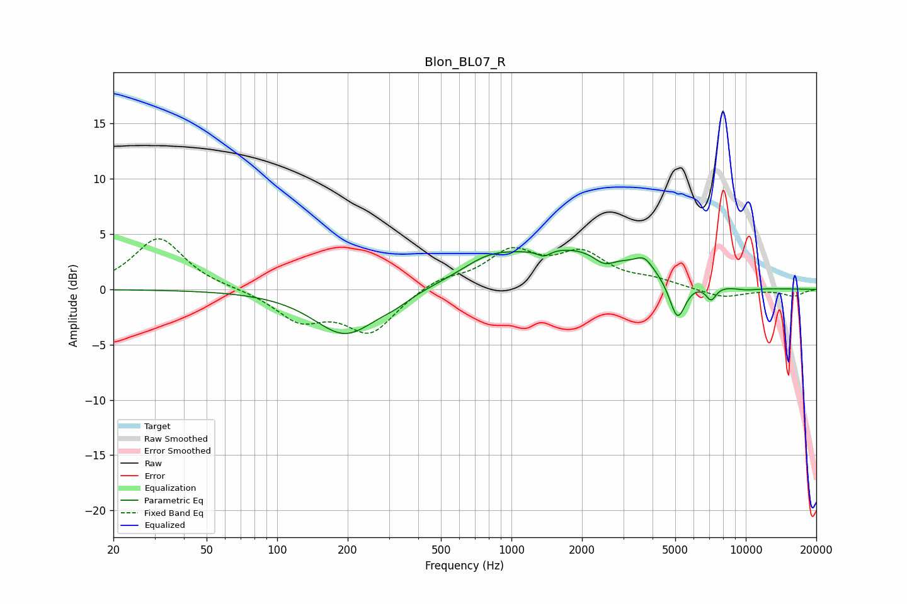

# Blon_BL07_R
See [usage instructions](https://github.com/jaakkopasanen/AutoEq#usage) for more options and info.

### Parametric EQs
Apply preamp of -3.6 dB when using parametric equalizer.

|   # | Type    |   Fc (Hz) |    Q |   Gain (dB) |
|-----|---------|-----------|------|-------------|
|   1 | Peaking |       196 | 1.05 |        -4.1 |
|   2 | Peaking |       318 | 2.08 |        -0.5 |
|   3 | Peaking |       798 | 1.25 |         1.4 |
|   4 | Peaking |      1375 | 4.87 |        -0.6 |
|   5 | Peaking |      1834 | 0.49 |         3.6 |
|   6 | Peaking |      2489 | 3.17 |        -1   |
|   7 | Peaking |      3690 | 3.77 |         1   |
|   8 | Peaking |      5113 | 3.93 |        -3.8 |
|   9 | Peaking |      7110 | 6    |        -1.3 |
|  10 | Peaking |     10000 | 1.96 |        -0.3 |

### Fixed Band EQs
When using fixed band (also called graphic) equalizer, apply preamp of **-4.7 dB** (if available) and set gains manually with these parameters.

|   # | Type    |   Fc (Hz) |    Q |   Gain (dB) |
|-----|---------|-----------|------|-------------|
|   1 | Peaking |        31 | 1.41 |         4.7 |
|   2 | Peaking |        62 | 1.41 |         0.1 |
|   3 | Peaking |       125 | 1.41 |        -2.6 |
|   4 | Peaking |       250 | 1.41 |        -3.8 |
|   5 | Peaking |       500 | 1.41 |         1   |
|   6 | Peaking |      1000 | 1.41 |         3.2 |
|   7 | Peaking |      2000 | 1.41 |         2.9 |
|   8 | Peaking |      4000 | 1.41 |         0.7 |
|   9 | Peaking |      8000 | 1.41 |        -0.8 |
|  10 | Peaking |     16000 | 1.41 |        -0.6 |

### Graphs

