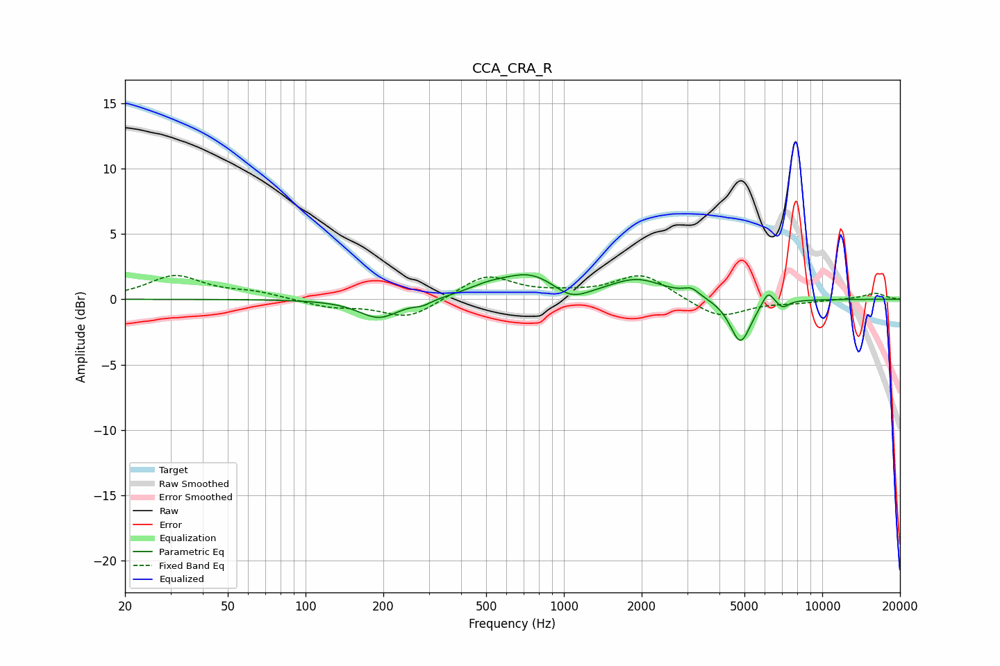

# CCA_CRA_R
See [usage instructions](https://github.com/jaakkopasanen/AutoEq#usage) for more options and info.

### Parametric EQs
Apply preamp of -2.0 dB when using parametric equalizer.

|   # | Type    |   Fc (Hz) |    Q |   Gain (dB) |
|-----|---------|-----------|------|-------------|
|   1 | Peaking |       192 | 1.82 |        -1.5 |
|   2 | Peaking |       284 | 4.27 |        -0.3 |
|   3 | Peaking |       503 | 1.77 |         0.6 |
|   4 | Peaking |       740 | 1.29 |         1.8 |
|   5 | Peaking |      1065 | 2.14 |        -1   |
|   6 | Peaking |      1918 | 1.31 |         1.5 |
|   7 | Peaking |      3117 | 4.66 |         0.6 |
|   8 | Peaking |      4824 | 3.42 |        -3.4 |
|   9 | Peaking |      6167 | 6    |         1.1 |
|  10 | Peaking |      7030 | 6    |        -0.5 |

### Fixed Band EQs
When using fixed band (also called graphic) equalizer, apply preamp of **-1.9 dB** (if available) and set gains manually with these parameters.

|   # | Type    |   Fc (Hz) |    Q |   Gain (dB) |
|-----|---------|-----------|------|-------------|
|   1 | Peaking |        31 | 1.41 |         1.8 |
|   2 | Peaking |        62 | 1.41 |         0.5 |
|   3 | Peaking |       125 | 1.41 |        -0.6 |
|   4 | Peaking |       250 | 1.41 |        -1.5 |
|   5 | Peaking |       500 | 1.41 |         1.9 |
|   6 | Peaking |      1000 | 1.41 |         0.3 |
|   7 | Peaking |      2000 | 1.41 |         1.9 |
|   8 | Peaking |      4000 | 1.41 |        -1.5 |
|   9 | Peaking |      8000 | 1.41 |        -0.2 |
|  10 | Peaking |     16000 | 1.41 |         0.5 |

### Graphs

