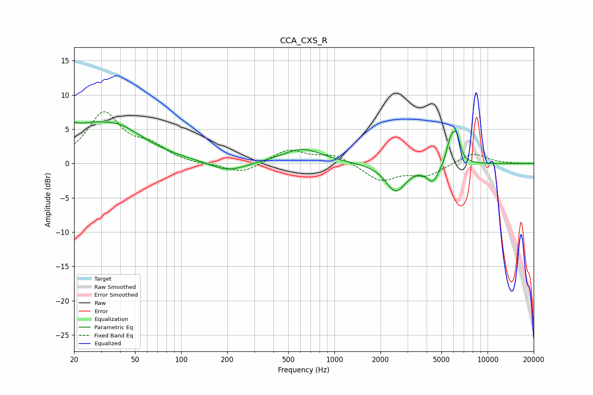

# CCA_CXS_R
See [usage instructions](https://github.com/jaakkopasanen/AutoEq#usage) for more options and info.

### Parametric EQs
Apply preamp of -6.2 dB when using parametric equalizer.

|   # | Type    |   Fc (Hz) |    Q |   Gain (dB) |
|-----|---------|-----------|------|-------------|
|   1 | Peaking |        20 | 5.68 |         0.6 |
|   2 | Peaking |        26 | 0.51 |         5.5 |
|   3 | Peaking |        43 | 1.23 |         1.2 |
|   4 | Peaking |        48 | 5.75 |        -0.1 |
|   5 | Peaking |       202 | 1.22 |        -1.4 |
|   6 | Peaking |       616 | 1.06 |         2.2 |
|   7 | Peaking |      2519 | 2.13 |        -4   |
|   8 | Peaking |      4396 | 3.35 |        -2.5 |
|   9 | Peaking |      5757 | 5.14 |         3.4 |
|  10 | Peaking |      6276 | 5.72 |         3.3 |

### Fixed Band EQs
When using fixed band (also called graphic) equalizer, apply preamp of **-7.6 dB** (if available) and set gains manually with these parameters.

|   # | Type    |   Fc (Hz) |    Q |   Gain (dB) |
|-----|---------|-----------|------|-------------|
|   1 | Peaking |        31 | 1.41 |         7.2 |
|   2 | Peaking |        62 | 1.41 |         2.1 |
|   3 | Peaking |       125 | 1.41 |        -0.2 |
|   4 | Peaking |       250 | 1.41 |        -1.5 |
|   5 | Peaking |       500 | 1.41 |         2   |
|   6 | Peaking |      1000 | 1.41 |         1.3 |
|   7 | Peaking |      2000 | 1.41 |        -2.5 |
|   8 | Peaking |      4000 | 1.41 |        -1.7 |
|   9 | Peaking |      8000 | 1.41 |         1.6 |
|  10 | Peaking |     16000 | 1.41 |        -0   |

### Graphs

