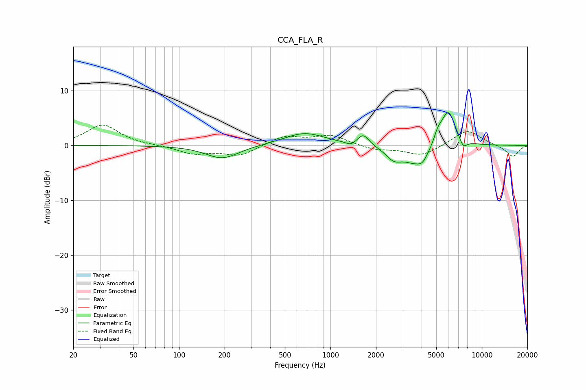

# CCA_FLA_R
See [usage instructions](https://github.com/jaakkopasanen/AutoEq#usage) for more options and info.

### Parametric EQs
Apply preamp of -6.1 dB when using parametric equalizer.

|   # | Type    |   Fc (Hz) |    Q |   Gain (dB) |
|-----|---------|-----------|------|-------------|
|   1 | Peaking |       193 | 1.3  |        -2.4 |
|   2 | Peaking |       674 | 1.04 |         2.3 |
|   3 | Peaking |      1365 | 4.52 |        -0.7 |
|   4 | Peaking |      1647 | 3.74 |         2.1 |
|   5 | Peaking |      2618 | 2.74 |        -1.9 |
|   6 | Peaking |      3741 | 1.54 |        -3.5 |
|   7 | Peaking |      4063 | 5.01 |        -0.9 |
|   8 | Peaking |      5122 | 5.28 |         1.7 |
|   9 | Peaking |      5993 | 2.74 |         6.8 |
|  10 | Peaking |      7528 | 5.09 |        -1.7 |

### Fixed Band EQs
When using fixed band (also called graphic) equalizer, apply preamp of **-3.8 dB** (if available) and set gains manually with these parameters.

|   # | Type    |   Fc (Hz) |    Q |   Gain (dB) |
|-----|---------|-----------|------|-------------|
|   1 | Peaking |        31 | 1.41 |         3.8 |
|   2 | Peaking |        62 | 1.41 |         0   |
|   3 | Peaking |       125 | 1.41 |        -1.5 |
|   4 | Peaking |       250 | 1.41 |        -1.9 |
|   5 | Peaking |       500 | 1.41 |         1.7 |
|   6 | Peaking |      1000 | 1.41 |         1.8 |
|   7 | Peaking |      2000 | 1.41 |        -0.8 |
|   8 | Peaking |      4000 | 1.41 |        -1.9 |
|   9 | Peaking |      8000 | 1.41 |         2.9 |
|  10 | Peaking |     16000 | 1.41 |        -2.1 |

### Graphs

