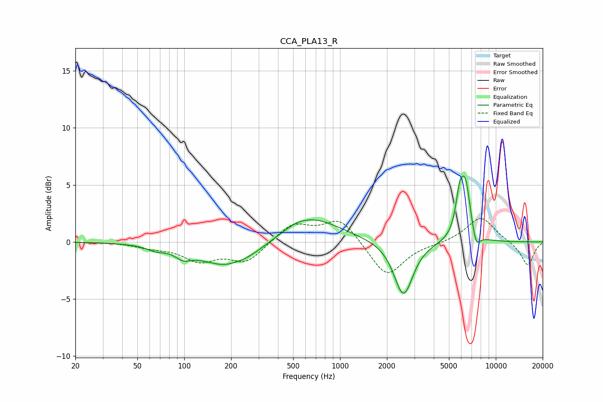

# CCA_PLA13_R
See [usage instructions](https://github.com/jaakkopasanen/AutoEq#usage) for more options and info.

### Parametric EQs
Apply preamp of -5.9 dB when using parametric equalizer.

|   # | Type    |   Fc (Hz) |    Q |   Gain (dB) |
|-----|---------|-----------|------|-------------|
|   1 | Peaking |        66 | 2.59 |        -0.4 |
|   2 | Peaking |        99 | 2.86 |        -0.7 |
|   3 | Peaking |       197 | 0.77 |        -2.3 |
|   4 | Peaking |       211 | 3.81 |         0.1 |
|   5 | Peaking |       523 | 2.06 |         0.2 |
|   6 | Peaking |       643 | 0.74 |         2.3 |
|   7 | Peaking |      2554 | 2.34 |        -4.8 |
|   8 | Peaking |      5853 | 5.39 |         2.8 |
|   9 | Peaking |      6395 | 4.12 |         4.7 |
|  10 | Peaking |      7475 | 5.29 |        -1.4 |

### Fixed Band EQs
When using fixed band (also called graphic) equalizer, apply preamp of **-2.1 dB** (if available) and set gains manually with these parameters.

|   # | Type    |   Fc (Hz) |    Q |   Gain (dB) |
|-----|---------|-----------|------|-------------|
|   1 | Peaking |        31 | 1.41 |         0   |
|   2 | Peaking |        62 | 1.41 |        -0.4 |
|   3 | Peaking |       125 | 1.41 |        -1.5 |
|   4 | Peaking |       250 | 1.41 |        -1.7 |
|   5 | Peaking |       500 | 1.41 |         1.6 |
|   6 | Peaking |      1000 | 1.41 |         2.1 |
|   7 | Peaking |      2000 | 1.41 |        -3.1 |
|   8 | Peaking |      4000 | 1.41 |        -0.1 |
|   9 | Peaking |      8000 | 1.41 |         2.2 |
|  10 | Peaking |     16000 | 1.41 |        -2.1 |

### Graphs

