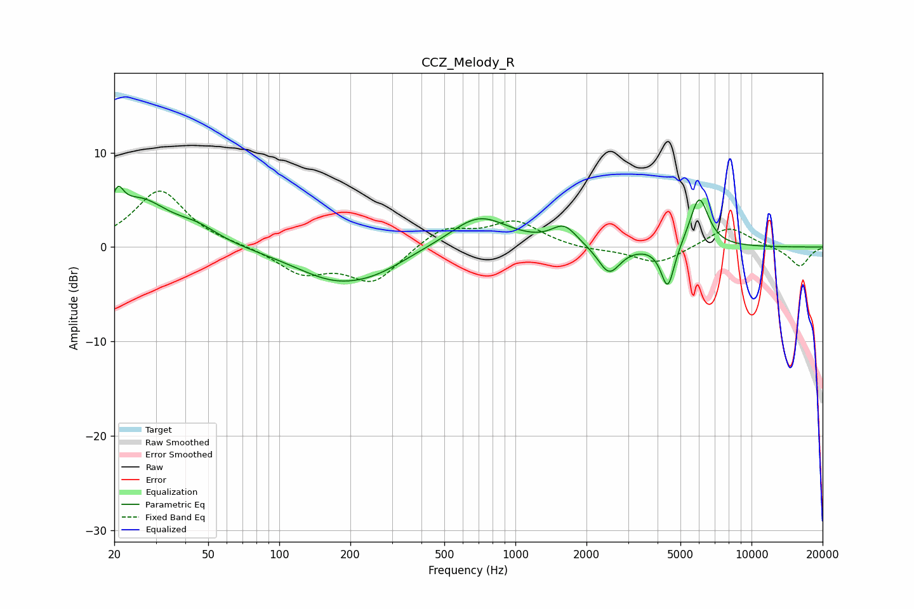

# CCZ_Melody_R
See [usage instructions](https://github.com/jaakkopasanen/AutoEq#usage) for more options and info.

### Parametric EQs
Apply preamp of -6.5 dB when using parametric equalizer.

|   # | Type    |   Fc (Hz) |    Q |   Gain (dB) |
|-----|---------|-----------|------|-------------|
|   1 | Peaking |        21 | 5.87 |         2.6 |
|   2 | Peaking |        26 | 1.16 |         4.7 |
|   3 | Peaking |        45 | 1.51 |         1.4 |
|   4 | Peaking |       176 | 0.78 |        -3.4 |
|   5 | Peaking |       266 | 1.2  |        -0.9 |
|   6 | Peaking |       701 | 1.14 |         3.4 |
|   7 | Peaking |      1607 | 2.65 |         2   |
|   8 | Peaking |      2493 | 3.02 |        -3   |
|   9 | Peaking |      4418 | 4.92 |        -4.7 |
|  10 | Peaking |      5999 | 3.49 |         5.4 |

### Fixed Band EQs
When using fixed band (also called graphic) equalizer, apply preamp of **-6.0 dB** (if available) and set gains manually with these parameters.

|   # | Type    |   Fc (Hz) |    Q |   Gain (dB) |
|-----|---------|-----------|------|-------------|
|   1 | Peaking |        31 | 1.41 |         6   |
|   2 | Peaking |        62 | 1.41 |         0.1 |
|   3 | Peaking |       125 | 1.41 |        -2.6 |
|   4 | Peaking |       250 | 1.41 |        -3.6 |
|   5 | Peaking |       500 | 1.41 |         2.1 |
|   6 | Peaking |      1000 | 1.41 |         2.6 |
|   7 | Peaking |      2000 | 1.41 |        -0.3 |
|   8 | Peaking |      4000 | 1.41 |        -1.8 |
|   9 | Peaking |      8000 | 1.41 |         2.2 |
|  10 | Peaking |     16000 | 1.41 |        -2.1 |

### Graphs

