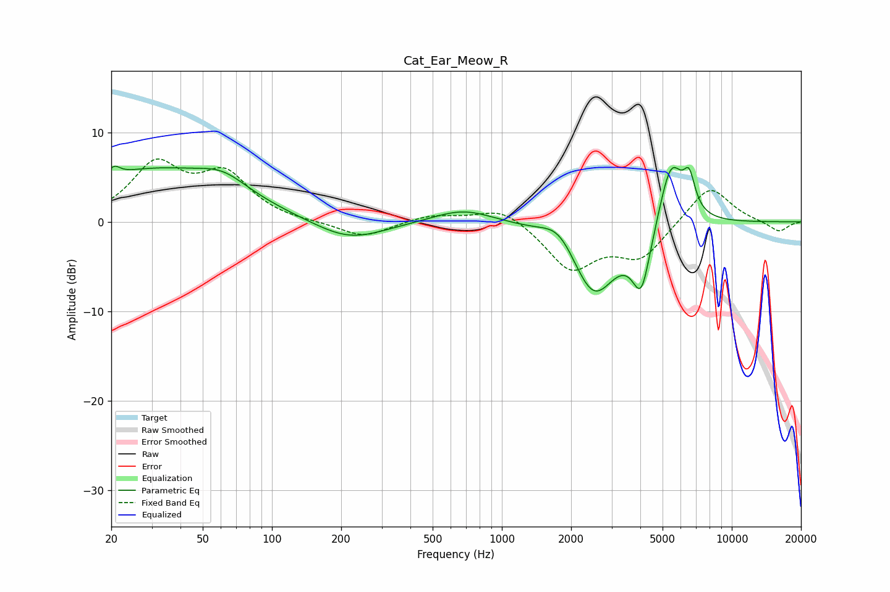

# Cat_Ear_Meow_R
See [usage instructions](https://github.com/jaakkopasanen/AutoEq#usage) for more options and info.

### Parametric EQs
Apply preamp of -6.3 dB when using parametric equalizer.

|   # | Type    |   Fc (Hz) |    Q |   Gain (dB) |
|-----|---------|-----------|------|-------------|
|   1 | Peaking |        21 | 5.93 |         1   |
|   2 | Peaking |        30 | 0.42 |         5.6 |
|   3 | Peaking |        61 | 1.32 |         1.9 |
|   4 | Peaking |       216 | 0.91 |        -2.3 |
|   5 | Peaking |       681 | 1.07 |         1.6 |
|   6 | Peaking |      1781 | 1.84 |         2.6 |
|   7 | Peaking |      2505 | 1.37 |        -8.6 |
|   8 | Peaking |      4046 | 3.46 |        -6.8 |
|   9 | Peaking |      5442 | 2.54 |         7.6 |
|  10 | Peaking |      6530 | 5.46 |         3.5 |

### Fixed Band EQs
When using fixed band (also called graphic) equalizer, apply preamp of **-7.1 dB** (if available) and set gains manually with these parameters.

|   # | Type    |   Fc (Hz) |    Q |   Gain (dB) |
|-----|---------|-----------|------|-------------|
|   1 | Peaking |        31 | 1.41 |         6.1 |
|   2 | Peaking |        62 | 1.41 |         4.9 |
|   3 | Peaking |       125 | 1.41 |        -0.1 |
|   4 | Peaking |       250 | 1.41 |        -1.8 |
|   5 | Peaking |       500 | 1.41 |         0.8 |
|   6 | Peaking |      1000 | 1.41 |         1.8 |
|   7 | Peaking |      2000 | 1.41 |        -5.2 |
|   8 | Peaking |      4000 | 1.41 |        -3.8 |
|   9 | Peaking |      8000 | 1.41 |         4.2 |
|  10 | Peaking |     16000 | 1.41 |        -1.2 |

### Graphs

