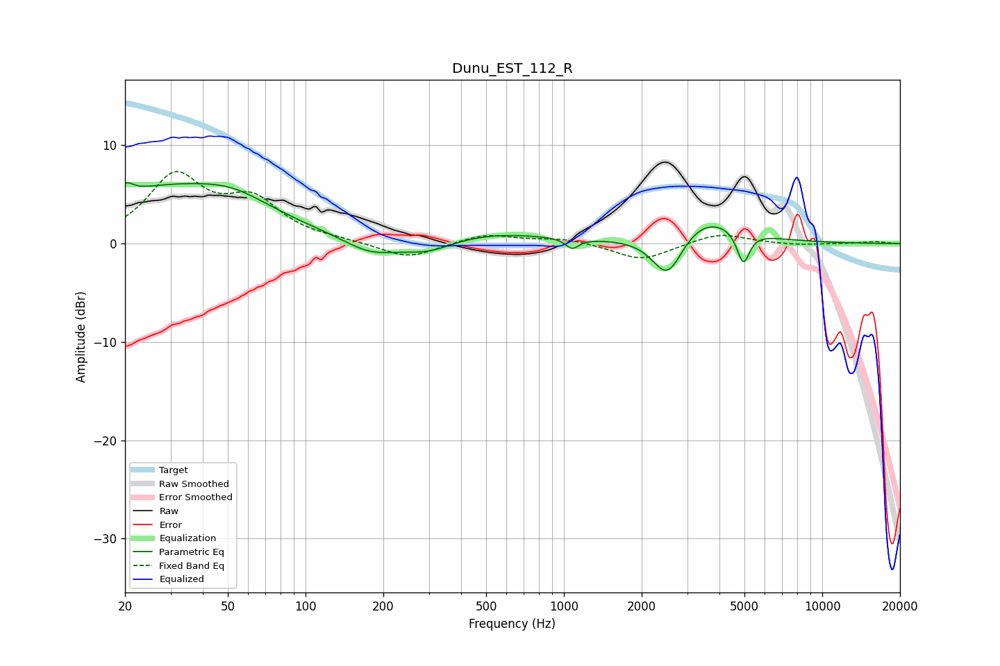

# Dunu_EST_112_R
See [usage instructions](https://github.com/jaakkopasanen/AutoEq#usage) for more options and info.

### Parametric EQs
Apply preamp of -6.3 dB when using parametric equalizer.

|   # | Type    |   Fc (Hz) |    Q |   Gain (dB) |
|-----|---------|-----------|------|-------------|
|   1 | Peaking |        20 | 5.48 |         1   |
|   2 | Peaking |        30 | 0.42 |         5.5 |
|   3 | Peaking |        53 | 1.1  |         1.3 |
|   4 | Peaking |       178 | 1.33 |        -1.7 |
|   5 | Peaking |       298 | 1.35 |        -1.4 |
|   6 | Peaking |       493 | 0.58 |         1.1 |
|   7 | Peaking |      1078 | 5.66 |        -1   |
|   8 | Peaking |      2521 | 2.34 |        -4.7 |
|   9 | Peaking |      3491 | 1.04 |         3   |
|  10 | Peaking |      4946 | 5.79 |        -3.4 |

### Fixed Band EQs
When using fixed band (also called graphic) equalizer, apply preamp of **-7.4 dB** (if available) and set gains manually with these parameters.

|   # | Type    |   Fc (Hz) |    Q |   Gain (dB) |
|-----|---------|-----------|------|-------------|
|   1 | Peaking |        31 | 1.41 |         6.6 |
|   2 | Peaking |        62 | 1.41 |         3.9 |
|   3 | Peaking |       125 | 1.41 |         0.2 |
|   4 | Peaking |       250 | 1.41 |        -1.6 |
|   5 | Peaking |       500 | 1.41 |         1   |
|   6 | Peaking |      1000 | 1.41 |         0.5 |
|   7 | Peaking |      2000 | 1.41 |        -1.7 |
|   8 | Peaking |      4000 | 1.41 |         1.1 |
|   9 | Peaking |      8000 | 1.41 |        -0.2 |
|  10 | Peaking |     16000 | 1.41 |         0.2 |

### Graphs

