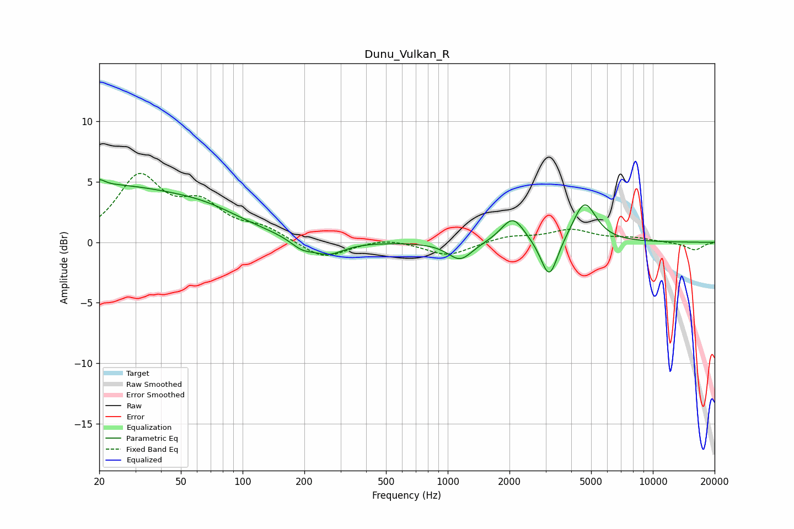

# Dunu_Vulkan_R
See [usage instructions](https://github.com/jaakkopasanen/AutoEq#usage) for more options and info.

### Parametric EQs
Apply preamp of -5.3 dB when using parametric equalizer.

|   # | Type    |   Fc (Hz) |    Q |   Gain (dB) |
|-----|---------|-----------|------|-------------|
|   1 | Peaking |        20 | 5.87 |         3.3 |
|   2 | Peaking |        20 | 5.98 |        -2.8 |
|   3 | Peaking |        21 | 0.34 |         4.5 |
|   4 | Peaking |        67 | 0.76 |         1.1 |
|   5 | Peaking |       195 | 2.5  |        -0.8 |
|   6 | Peaking |       263 | 1.83 |        -1.1 |
|   7 | Peaking |      1150 | 2.37 |        -1.5 |
|   8 | Peaking |      2075 | 2.51 |         2.1 |
|   9 | Peaking |      3127 | 3.46 |        -3.4 |
|  10 | Peaking |      4645 | 2.48 |         3.4 |

### Fixed Band EQs
When using fixed band (also called graphic) equalizer, apply preamp of **-5.8 dB** (if available) and set gains manually with these parameters.

|   # | Type    |   Fc (Hz) |    Q |   Gain (dB) |
|-----|---------|-----------|------|-------------|
|   1 | Peaking |        31 | 1.41 |         5.2 |
|   2 | Peaking |        62 | 1.41 |         2.7 |
|   3 | Peaking |       125 | 1.41 |         1   |
|   4 | Peaking |       250 | 1.41 |        -1.4 |
|   5 | Peaking |       500 | 1.41 |         0.4 |
|   6 | Peaking |      1000 | 1.41 |        -1.1 |
|   7 | Peaking |      2000 | 1.41 |         0.5 |
|   8 | Peaking |      4000 | 1.41 |         1   |
|   9 | Peaking |      8000 | 1.41 |         0.3 |
|  10 | Peaking |     16000 | 1.41 |        -0.6 |

### Graphs

