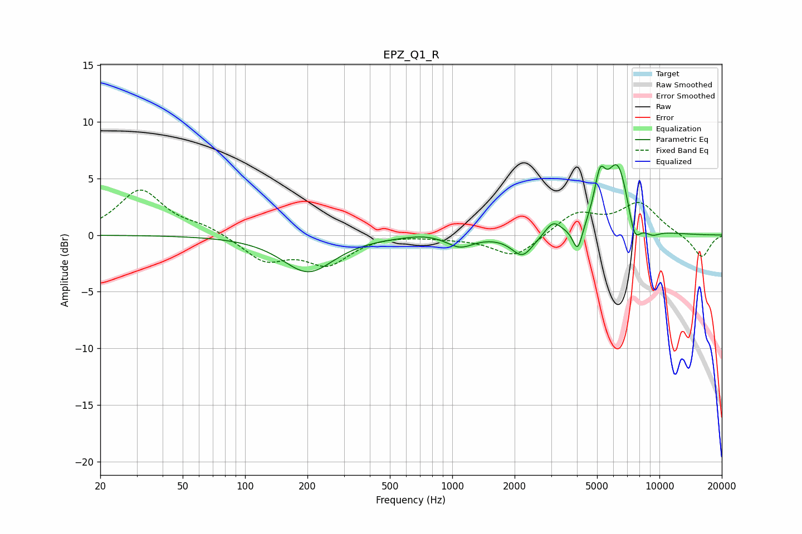

# EPZ_Q1_R
See [usage instructions](https://github.com/jaakkopasanen/AutoEq#usage) for more options and info.

### Parametric EQs
Apply preamp of -6.3 dB when using parametric equalizer.

|   # | Type    |   Fc (Hz) |    Q |   Gain (dB) |
|-----|---------|-----------|------|-------------|
|   1 | Peaking |       202 | 1.14 |        -3.2 |
|   2 | Peaking |       734 | 1.58 |         0.3 |
|   3 | Peaking |      1091 | 2.22 |        -1   |
|   4 | Peaking |      2183 | 2.71 |        -1.9 |
|   5 | Peaking |      3064 | 3.8  |         1.2 |
|   6 | Peaking |      4031 | 5.99 |        -2.3 |
|   7 | Peaking |      5160 | 5.23 |         3.5 |
|   8 | Peaking |      6301 | 2.4  |         6.3 |
|   9 | Peaking |      7564 | 4.33 |        -2.6 |
|  10 | Peaking |      9204 | 3.24 |        -0.6 |

### Fixed Band EQs
When using fixed band (also called graphic) equalizer, apply preamp of **-4.1 dB** (if available) and set gains manually with these parameters.

|   # | Type    |   Fc (Hz) |    Q |   Gain (dB) |
|-----|---------|-----------|------|-------------|
|   1 | Peaking |        31 | 1.41 |         3.9 |
|   2 | Peaking |        62 | 1.41 |         0.7 |
|   3 | Peaking |       125 | 1.41 |        -2.2 |
|   4 | Peaking |       250 | 1.41 |        -2.4 |
|   5 | Peaking |       500 | 1.41 |         0.1 |
|   6 | Peaking |      1000 | 1.41 |        -0.2 |
|   7 | Peaking |      2000 | 1.41 |        -2   |
|   8 | Peaking |      4000 | 1.41 |         1.9 |
|   9 | Peaking |      8000 | 1.41 |         2.7 |
|  10 | Peaking |     16000 | 1.41 |        -2   |

### Graphs

