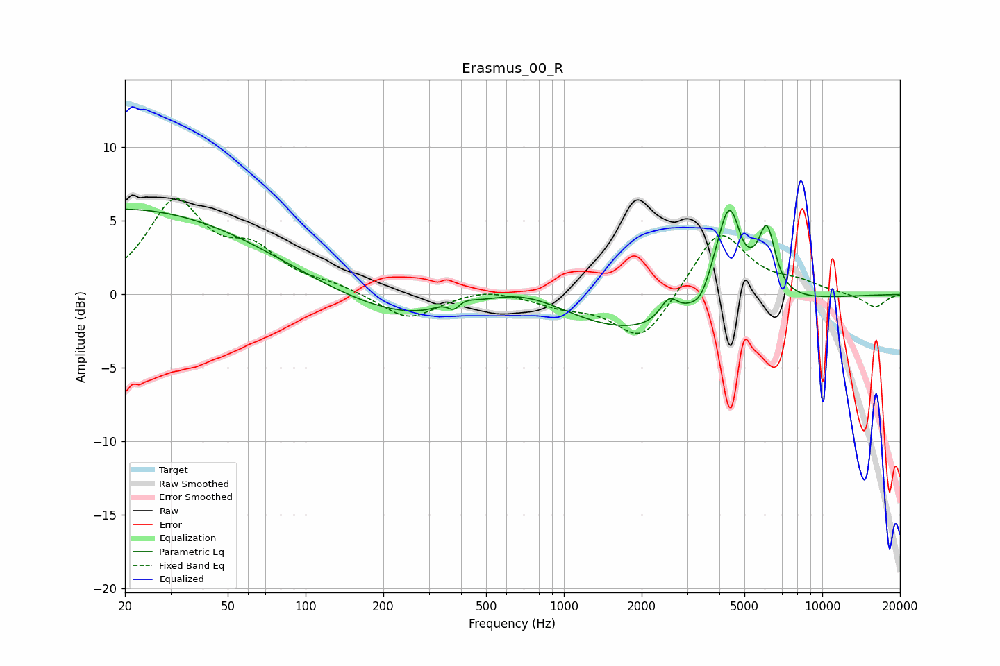

# Erasmus_00_R
See [usage instructions](https://github.com/jaakkopasanen/AutoEq#usage) for more options and info.

### Parametric EQs
Apply preamp of -5.9 dB when using parametric equalizer.

|   # | Type    |   Fc (Hz) |    Q |   Gain (dB) |
|-----|---------|-----------|------|-------------|
|   1 | Peaking |        20 | 0.26 |         5.8 |
|   2 | Peaking |       376 | 5.09 |        -1.2 |
|   3 | Peaking |       378 | 2.73 |         1.3 |
|   4 | Peaking |       677 | 0.67 |         3.5 |
|   5 | Peaking |       895 | 0.19 |        -3.9 |
|   6 | Peaking |      2553 | 3.99 |         1.5 |
|   7 | Peaking |      3392 | 4.67 |        -0.6 |
|   8 | Peaking |      4365 | 2.5  |         7.5 |
|   9 | Peaking |      4904 | 5.42 |        -0.6 |
|  10 | Peaking |      6111 | 4.2  |         4.3 |

### Fixed Band EQs
When using fixed band (also called graphic) equalizer, apply preamp of **-6.6 dB** (if available) and set gains manually with these parameters.

|   # | Type    |   Fc (Hz) |    Q |   Gain (dB) |
|-----|---------|-----------|------|-------------|
|   1 | Peaking |        31 | 1.41 |         6   |
|   2 | Peaking |        62 | 1.41 |         2.5 |
|   3 | Peaking |       125 | 1.41 |         0.5 |
|   4 | Peaking |       250 | 1.41 |        -1.7 |
|   5 | Peaking |       500 | 1.41 |         0.5 |
|   6 | Peaking |      1000 | 1.41 |        -0.7 |
|   7 | Peaking |      2000 | 1.41 |        -3.3 |
|   8 | Peaking |      4000 | 1.41 |         4.5 |
|   9 | Peaking |      8000 | 1.41 |         0.7 |
|  10 | Peaking |     16000 | 1.41 |        -0.9 |

### Graphs

