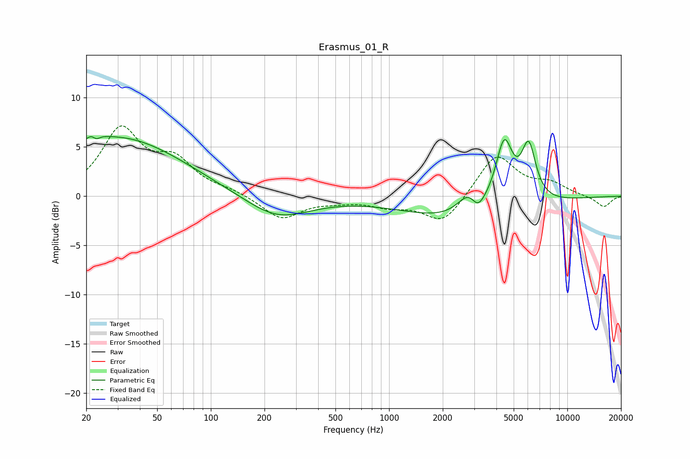

# Erasmus_01_R
See [usage instructions](https://github.com/jaakkopasanen/AutoEq#usage) for more options and info.

### Parametric EQs
Apply preamp of -6.2 dB when using parametric equalizer.

|   # | Type    |   Fc (Hz) |    Q |   Gain (dB) |
|-----|---------|-----------|------|-------------|
|   1 | Peaking |        22 | 4.33 |         2.5 |
|   2 | Peaking |        23 | 5.34 |        -2.2 |
|   3 | Peaking |        23 | 0.47 |         1.2 |
|   4 | Peaking |        32 | 0.38 |         4.9 |
|   5 | Peaking |       235 | 0.79 |        -2.4 |
|   6 | Peaking |      2764 | 0.43 |        -2.6 |
|   7 | Peaking |      2871 | 2.17 |         2.8 |
|   8 | Peaking |      3131 | 3.53 |        -2   |
|   9 | Peaking |      4423 | 2.89 |         6.7 |
|  10 | Peaking |      6065 | 3.35 |         5.7 |

### Fixed Band EQs
When using fixed band (also called graphic) equalizer, apply preamp of **-7.2 dB** (if available) and set gains manually with these parameters.

|   # | Type    |   Fc (Hz) |    Q |   Gain (dB) |
|-----|---------|-----------|------|-------------|
|   1 | Peaking |        31 | 1.41 |         6.6 |
|   2 | Peaking |        62 | 1.41 |         3.2 |
|   3 | Peaking |       125 | 1.41 |         0.5 |
|   4 | Peaking |       250 | 1.41 |        -2.3 |
|   5 | Peaking |       500 | 1.41 |        -0.4 |
|   6 | Peaking |      1000 | 1.41 |        -0.9 |
|   7 | Peaking |      2000 | 1.41 |        -2.8 |
|   8 | Peaking |      4000 | 1.41 |         4.3 |
|   9 | Peaking |      8000 | 1.41 |         1.1 |
|  10 | Peaking |     16000 | 1.41 |        -1.1 |

### Graphs

