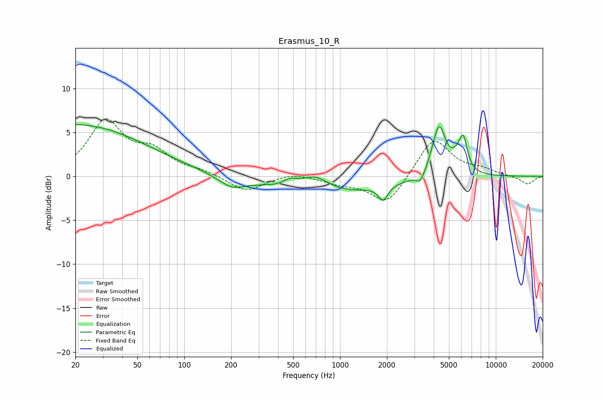

# Erasmus_10_R
See [usage instructions](https://github.com/jaakkopasanen/AutoEq#usage) for more options and info.

### Parametric EQs
Apply preamp of -6.0 dB when using parametric equalizer.

|   # | Type    |   Fc (Hz) |    Q |   Gain (dB) |
|-----|---------|-----------|------|-------------|
|   1 | Peaking |        20 | 0.31 |         5.9 |
|   2 | Peaking |       202 | 1.66 |        -1.2 |
|   3 | Peaking |       478 | 3.32 |         0.7 |
|   4 | Peaking |       689 | 1.52 |         1.9 |
|   5 | Peaking |       821 | 0.41 |        -2.2 |
|   6 | Peaking |      1892 | 4.82 |        -1.6 |
|   7 | Peaking |      3283 | 5.09 |        -1.2 |
|   8 | Peaking |      4319 | 3.24 |         5.8 |
|   9 | Peaking |      5576 | 3.89 |         1   |
|  10 | Peaking |      6184 | 5.24 |         3.6 |

### Fixed Band EQs
When using fixed band (also called graphic) equalizer, apply preamp of **-6.6 dB** (if available) and set gains manually with these parameters.

|   # | Type    |   Fc (Hz) |    Q |   Gain (dB) |
|-----|---------|-----------|------|-------------|
|   1 | Peaking |        31 | 1.41 |         6.1 |
|   2 | Peaking |        62 | 1.41 |         2.4 |
|   3 | Peaking |       125 | 1.41 |         0.5 |
|   4 | Peaking |       250 | 1.41 |        -1.8 |
|   5 | Peaking |       500 | 1.41 |         0.5 |
|   6 | Peaking |      1000 | 1.41 |        -0.7 |
|   7 | Peaking |      2000 | 1.41 |        -3.3 |
|   8 | Peaking |      4000 | 1.41 |         4.5 |
|   9 | Peaking |      8000 | 1.41 |         0.7 |
|  10 | Peaking |     16000 | 1.41 |        -0.9 |

### Graphs

