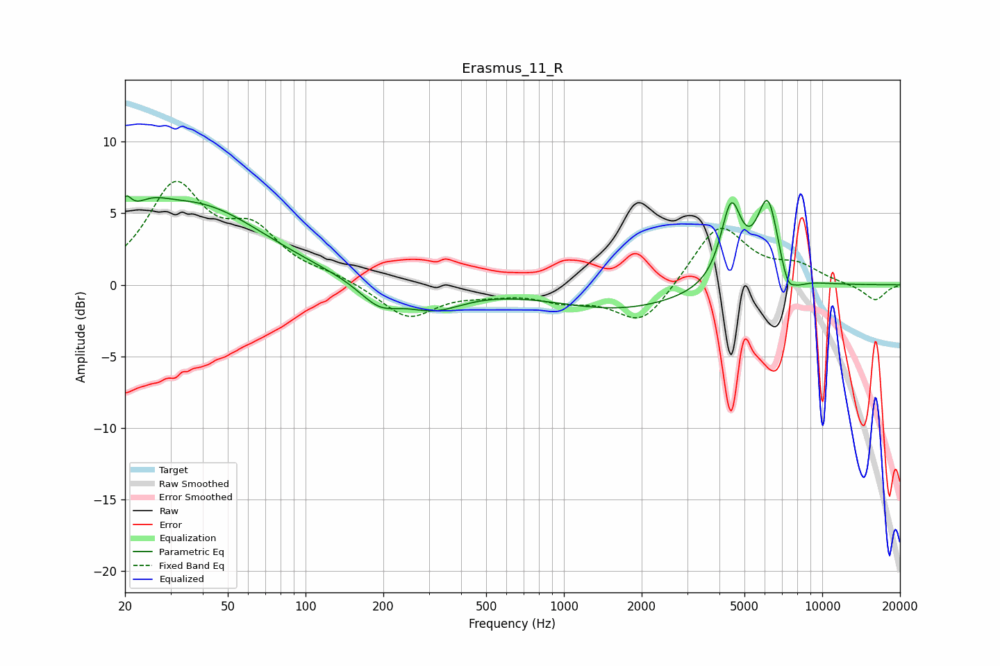

# Erasmus_11_R
See [usage instructions](https://github.com/jaakkopasanen/AutoEq#usage) for more options and info.

### Parametric EQs
Apply preamp of -6.3 dB when using parametric equalizer.

|   # | Type    |   Fc (Hz) |    Q |   Gain (dB) |
|-----|---------|-----------|------|-------------|
|   1 | Peaking |        20 | 5.93 |         1.8 |
|   2 | Peaking |        25 | 1.9  |         1.4 |
|   3 | Peaking |        38 | 0.53 |         5.4 |
|   4 | Peaking |       193 | 1.81 |        -1.5 |
|   5 | Peaking |       313 | 1.21 |        -1.6 |
|   6 | Peaking |      1667 | 0.54 |        -1.7 |
|   7 | Peaking |      4437 | 3.51 |         5.4 |
|   8 | Peaking |      6167 | 3.08 |         6.1 |
|   9 | Peaking |      7492 | 3.68 |        -2.7 |
|  10 | Peaking |      7704 | 5.75 |         0.8 |

### Fixed Band EQs
When using fixed band (also called graphic) equalizer, apply preamp of **-7.3 dB** (if available) and set gains manually with these parameters.

|   # | Type    |   Fc (Hz) |    Q |   Gain (dB) |
|-----|---------|-----------|------|-------------|
|   1 | Peaking |        31 | 1.41 |         6.6 |
|   2 | Peaking |        62 | 1.41 |         3.2 |
|   3 | Peaking |       125 | 1.41 |         0.5 |
|   4 | Peaking |       250 | 1.41 |        -2.3 |
|   5 | Peaking |       500 | 1.41 |        -0.4 |
|   6 | Peaking |      1000 | 1.41 |        -0.9 |
|   7 | Peaking |      2000 | 1.41 |        -2.8 |
|   8 | Peaking |      4000 | 1.41 |         4.3 |
|   9 | Peaking |      8000 | 1.41 |         1.2 |
|  10 | Peaking |     16000 | 1.41 |        -1.1 |

### Graphs

